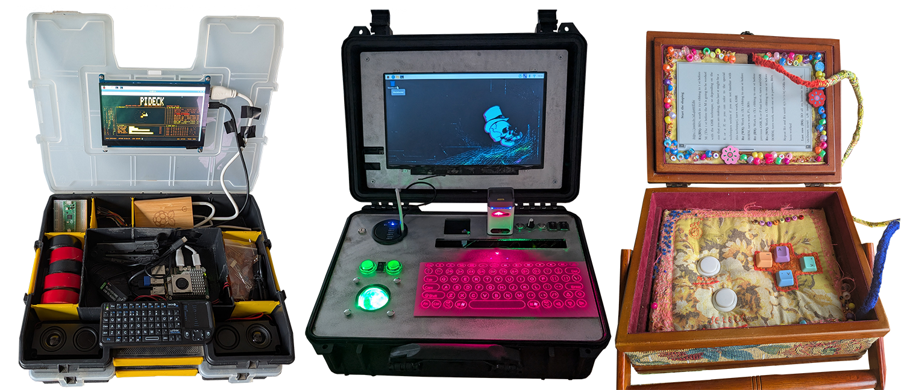

## What you will make

Cyberdecks are homemade, personalised computers, and most are made with a Raspberry Pi.

{:width="1000px"}

You can get creative with what your cyberdeck does and how it looks. It might focus on playing music, showing knitting patterns, or playing games. 

### You will need:
- a Raspberry Pi
- a microSD card
- a power supply
- a keyboard and a display
- materials for a case

> [!INFO]
>
> The word cyberdeck comes from William Gibson’s 1984 sci-fi novel Neuromancer. Gibson never explains how it works, which is why makers have found it so fun to re-invent.
