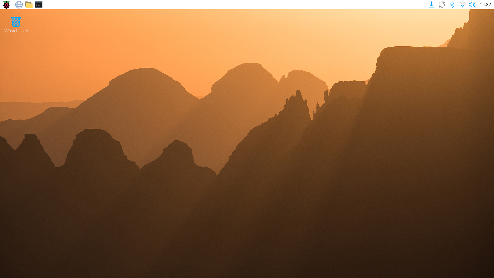
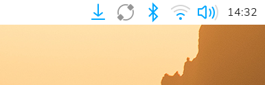

## On the desktop

The first time you switch on, the Raspberry Pi loads is slower than normal. It will show the Raspberry Pi logo during the loading. 

When it has finished loading you will see the start screen.

{:width="450px"}

> [!TASK]
>
> If prompted, use the same username and password you set in Imager.

> [!TASK]
>
> Let any updates run and restart if it asks.

> [!TASK]
>
> Check the network icon on the top right. It should show wi-fi, not two red crosses.

{:width="450px"}

> [!TIP]
>
> A Raspberry Pi can run with no display and no keyboard at all. You can do this with Raspberry Pi Connect and SSH later in this project.

> [!DEBUG]
>
> The light is on, but screen is black? Check the HDMI cable. On a Raspberry Pi 4 or 5, use the socket nearest the power connector.
