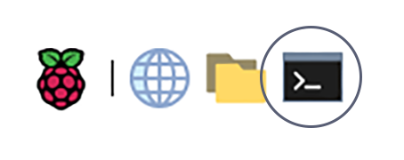
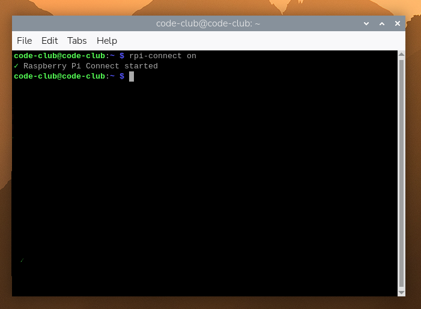
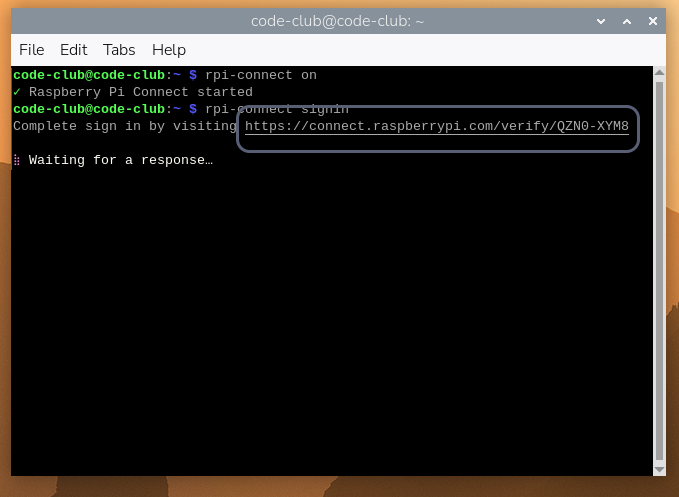
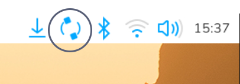
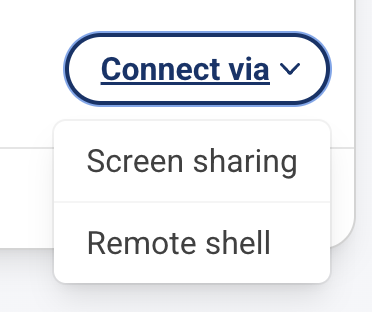
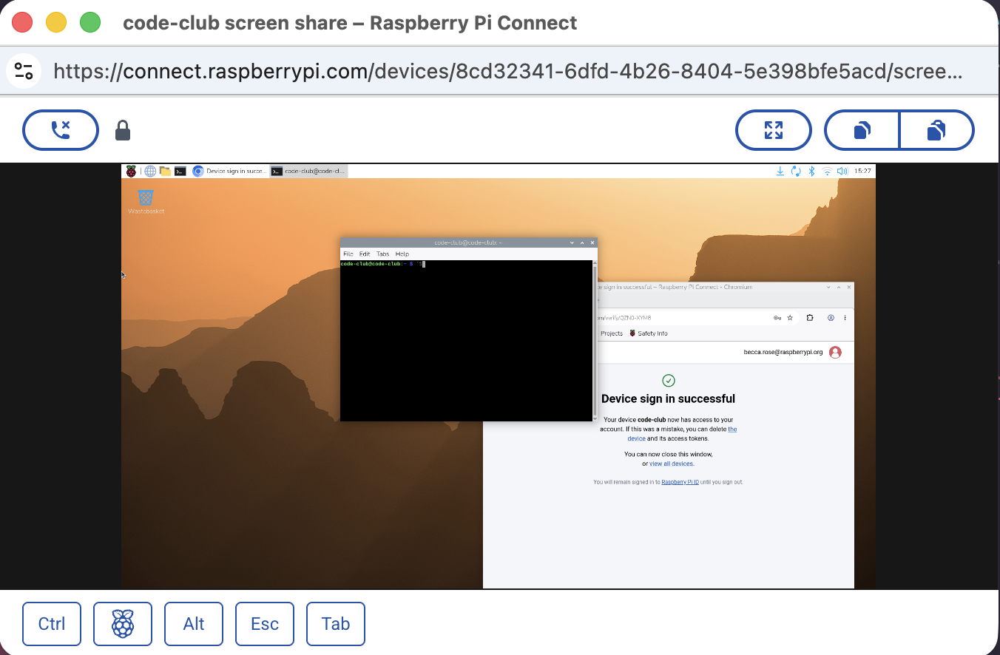

## Use Raspberry Pi Connect

**Raspberry Pi Connect** makes a remote version of your Raspberry Pi's desktop in another computer. 

This is handy for a cyberdeck, so that you can access the whole desktop without a monitor.

> [!TASK]
>
> On your Raspberry Pi, open a **terminal** by clicking the black icon in the top bar.

{:width="450px"}


> [!TASK]
>
> Copy or type this code into the terminal, after the `~$`. This turns Raspberry Pi Connect on. 
>
> ```bash
> rpi-connect on
> ```

{:width="450px"}

> [!TASK]
>
> Then type this line to sign in.
>
> ```bash
> rpi-connect signin
> ```

> [!TASK]
>
> Visit the web address from the response. This will be different for your set-up.
>
> Click on the link.

{:width="450px"}

> [!TASK]
> 
> The link will take you to a sign-in page.
>
> Sign in with your **Raspberry Pi ID**, or create one for free if you do not have an account yet.

{:width="450px"}

> [!TASK]
>
> Name your Raspberry Pi, then click **Create device and sign in**.

{:width="450px"}

**Test:** Check that the Connect icon in the top bar turns blue.

{:width="450px"}

> [!TASK]
>
> Go to another computer. Open [connect.raspberrypi.com](https://connect.raspberrypi.com){:target="_blank" rel="noopener"} and sign in with the same Raspberry Pi ID.

{:width="450px"}

> [!TASK]
>
> Find your Raspberry Pi. The example calls its device **pitowers**, but yours will show the name you chose. Select **Connect via**, then **Screen sharing**.

{:width="250px"}

**Test:** Check that the Raspberry Pi desktop appears in the browser. Moving the mouse there moves the pointer on the Raspberry Pi itself.

{:width="450px"}

> [!DEBUG]
>
> Shows as offline? Check the Raspberry Pi is on and still on wi-fi. Both computers need to be online.
>
> Screen sharing unavailable? Run `rpi-connect doctor` in a terminal on the Raspberry Pi. It checks the service, desktop and network, and puts a cross beside anything that needs attention.

> [!TIP]
>
> From now on you can connect to your raspberry pi through the [connect.raspberrypi.com](https://connect.raspberrypi.com){:target="_blank" rel="noopener"} link. As long as your Raspberry Pi is switched on, this connection works from anywhere, not only at home.
