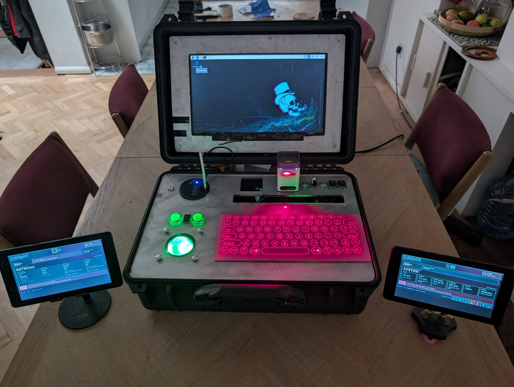

## Sideband

Sideband packs a Raspberry Pi, a screen and some unusual controls into a tough, sealable case. Inspired by the cyberspace decks in William Gibson's *Neuromancer*, it looks part field computer, part spacecraft console.

{:width="450px"}

A Raspberry Pi 5 with 8GB of memory and cooling runs Raspberry Pi OS, local webpages and network tools. The tablets and a Raspberry Pi Pico W each have their own jobs.

### The case and display

A ledge inside the case supports a 5mm cast-acrylic deck, painted silver on the back. Laser-cut openings hold the controls, sockets and storage slots.

The main display came from an old pi-topCEED desktop kit. It mounts on an acrylic panel in the lid and keeps its own power supply and button, so the screen can be switched off while the Pi keeps running.

### Input and controls

A keyboard projector, bought years ago and left unused, projects red laser keys onto the deck. An infrared sensor detects key presses and sends them to the Pi over Bluetooth. The projector has its own storage slot.

A trackball needs no room to move. Two illuminated arcade buttons act as its left and right mouse buttons, with the whole set connected through a PS/2-to-USB adapter.

{:width="450px"}

A key-lock switch selects the desktop or a local security-training game, which is still in development. The game uses an isolated practice network: security testing is only for systems you own or have permission to test. If a task needs internet access, only the main computer is connected; tablets and test devices stay isolated.

A long press on the shutdown button lets Raspberry Pi OS shut down safely without cutting power directly. A quick press does nothing, helping prevent accidents.

### Side displays

Two reused 7-inch Android tablets show webpages served by the Pi over its private Wi-Fi. They work without the venue's network or internet connection.

In desktop mode, **System** shows processor load, temperature, memory, storage and power status; **Network** shows connections and traffic. In game mode, **Scope** sets out the permitted targets and **Notes** provides a field log.

The tablets also control the lighting, but cannot control the Pi desktop. They charge in a slot in the deck when packed away.

### Lighting and power

A Pico W controls two LED grids beneath the acrylic, shining through engraved labels. Patterns can signal problems or add a futuristic startup effect. Either tablet, a mode button or a brightness dial can adjust the lights. A blackout switch cuts the decorative lighting, and a separate switch controls the arcade-button lamps.

A reused Circuit Playground board adds a glow behind the display, reflected by the mirrored surface in the lid.

Everything fits in the case, but Sideband needs a wall socket. One incoming cable feeds a switched extension lead, powering the Pi, display, lighting and a USB charger for the tablets and smaller boards.
