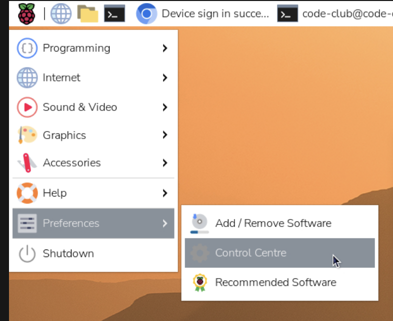
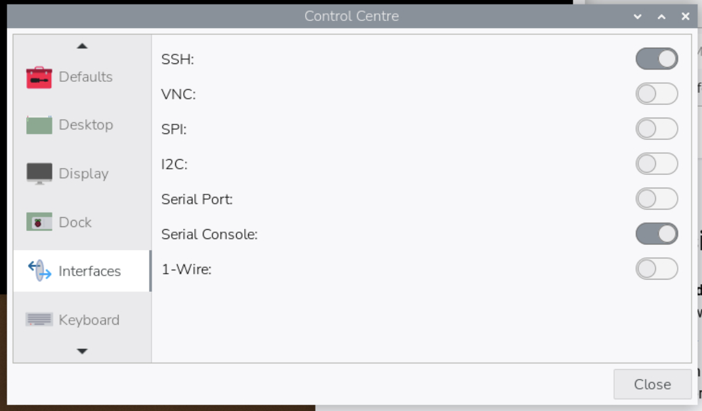

## Connect with SSH

**SSH** is short for **S**ecure **Sh**ell. You can use it to work on your Raspberry Pi from a different computer.

SSH is useful for typing commands and moving files. For the full desktop, use a monitor or Raspberry Pi Connect instead.

> [!INFO]
>
> To keep it secure, keep SSH inside your private network. Both computers should be connected to the same router or local network.

> [!TASK]
>
> Open a terminal on another computer.
>
> - **Windows** — open Terminal or PowerShell from the Start menu. 
> - **Mac** — open Terminal from Applications, then Utilities. 
> - **Linux** — open your usual terminal program.

> [!TASK]
>
> In the terminal type `ssh` and your username and hostname. For example, below the username is `alex` and the hostname is `cyberdeck`. You chose the password, username and hostname in the Imager. 
>
>
> ```bash
> ssh alex@cyberdeck.local
> ```

> [!TIP]
>
> The first time you connect, SSH asks if you trust this computer. 
>
> Check that you are connecting to your own Raspberry Pi, then type `yes` and press **Enter**.

> [!TASK]
>
> When prompted enter your password. 
>
> Type the full password, then press **Enter**. For security, nothing will appear on the screen when you type. 

**Test:** Check that the terminal prompt changes to show the Raspberry Pi's username and hostname, such as `alex@cyberdeck:~ $`.

> [!TASK]
>
> Ask the remote computer for its hostname.
>
> ```bash
> hostname
> ```
>
> If this responds with your hostname (such as `cyberdeck`), it confirms you are connected to the Raspberry Pi and not your own computer.

> [!TASK]
>
> You are now working on the Raspberry Pi. Try a few commands to explore.
>
> `ls` lists the files in the current folder. `cd foldername` moves into a folder.

> [!TASK]
>
> When you have finished, close the SSH connection by typing `exit`.
>
> ```bash
> exit
> ```

> [!DEBUG]
>
> **Could not resolve hostname?** Connect with the IP address instead. To find it, hover over the network icon in the top-right of the Raspberry Pi desktop. Your network name and numbers will differ from the example. 
>
>
> {:width="450px"}
>
> Use your IP address instead of the hostname.
>
> ```bash
> ssh alex@192.168.1.42
> ```
>
> **Connection timed out?** Check that the Raspberry Pi is on and both computers are on the same local network. Check the IP address again too.
>
> **Connection refused?** SSH may be off, or the address may lead to a different device Return to the first task and check both.
>
> **Permission denied?** Check the username and password you entered in Imager, and make sure **Caps Lock** is off.


> [!TIP]
>
> If you did not enable SSH in the Raspberry Pi Imager, you will need to switch it on.

> [!TASK]
>
> Switch it on by opening the Raspberry Pi menu, then **Preferences** and **Control Centre**. 

{:width="450px"}

> [!TASK]
>
> Select **Interfaces** and switch **SSH** on and select **Close**. If you changed the switch, restart the Raspberry Pi before you continue.

{:width="450px"}