## Knitdeck

Knitdeck is a small cyberdeck built for reading knitting patterns. It shows a pattern on an e-ink screen, and a few buttons turn the pages and hold your place while you knit.

{:width="450px"}

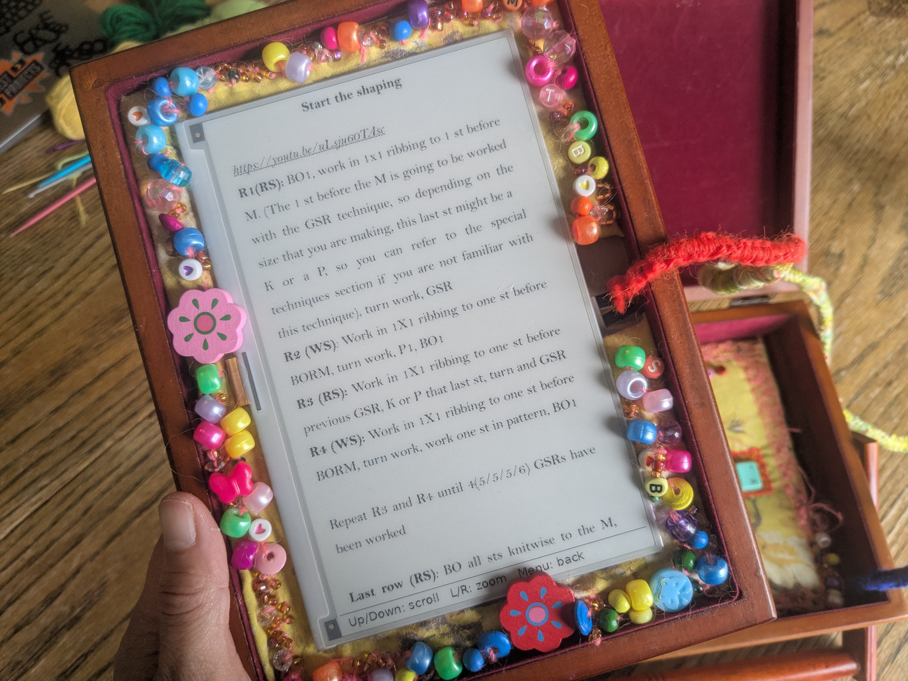{:width="450px"}

### Inspiration

Knitdeck grew out of a love of making and crafts, and a big pile of knitting patterns. The aim was something simple that felt like it belonged in the craft world rather than the tech one.

This is a figma mood board, of inspiration for the look and feel of it.

{:width="450px"}

### The enclosure

Knitdeck started from an old 1990s sewing box, bought second-hand — the kind that often turns up in charity shops and thrift stores. It already carried the craft feel the project was reaching for.

{:width="450px"}

### Making everything fit

The first plan for how everything would sit inside was optimistic.

{:width="450px"}

The real parts needed more room than expected, so the design kept changing through the making.

### Building it

The inside structure is cardboard. It took a lot of making and adjusting — cutting, gluing and trimming pieces until everything sat right.

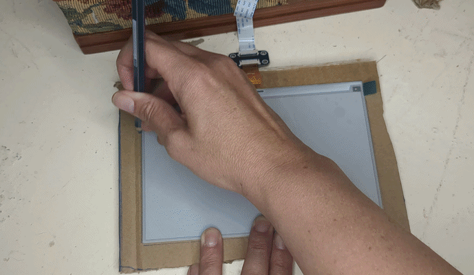{:width="450px"}

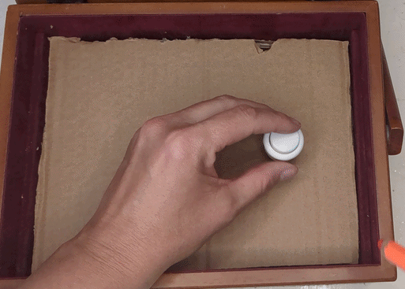{:width="450px"}

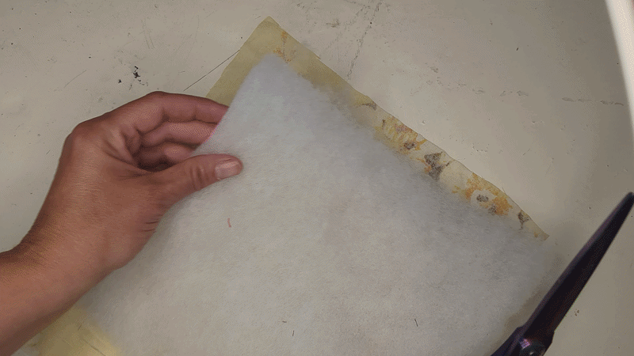{:width="450px"}

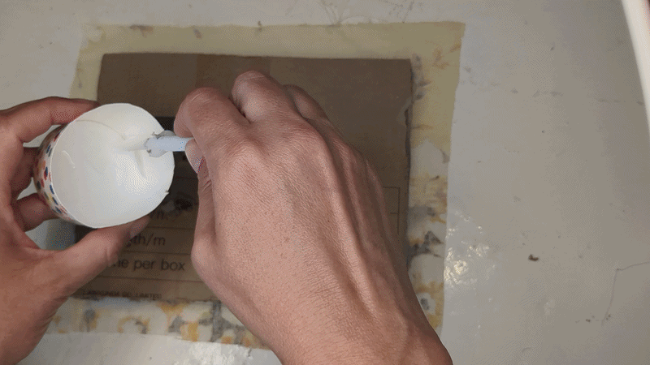{:width="450px"}

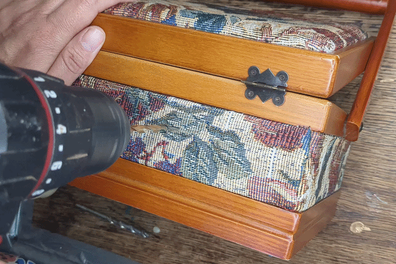{:width="450px"}

### Soldering

Soldering was the fiddliest part, and the one that felt most permanent. A build with no buttons is far simpler — even a few buttons adds a tangle of wires to manage.

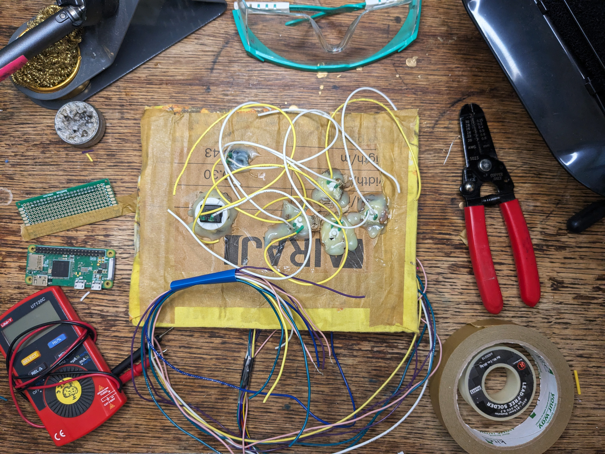{:width="450px"}

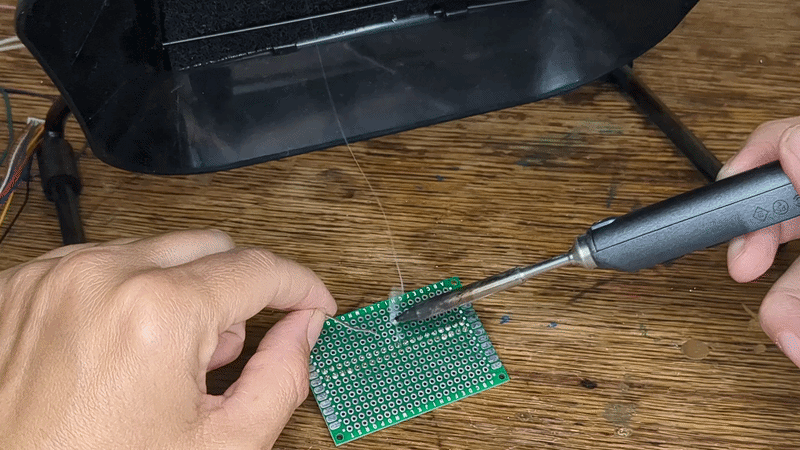{:width="450px"}

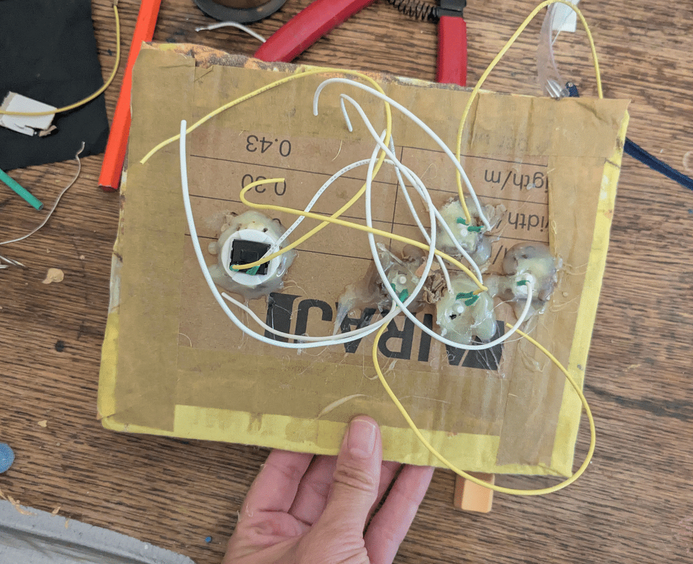{:width="450px"}

### The software

The software came together bit by bit over SSH, going back and forth with the code. It shows the pattern pages on the screen and moves through them with the buttons, each one mapped to a page turn or the stitch count. Everything was tested before the deck was assembled.

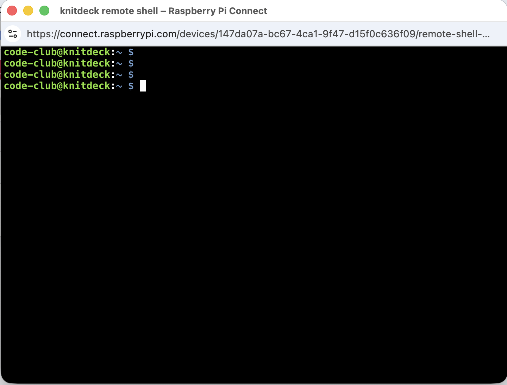{:width="450px"}

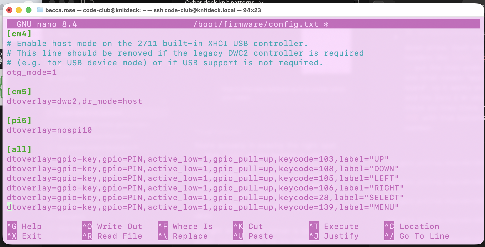{:width="450px"}

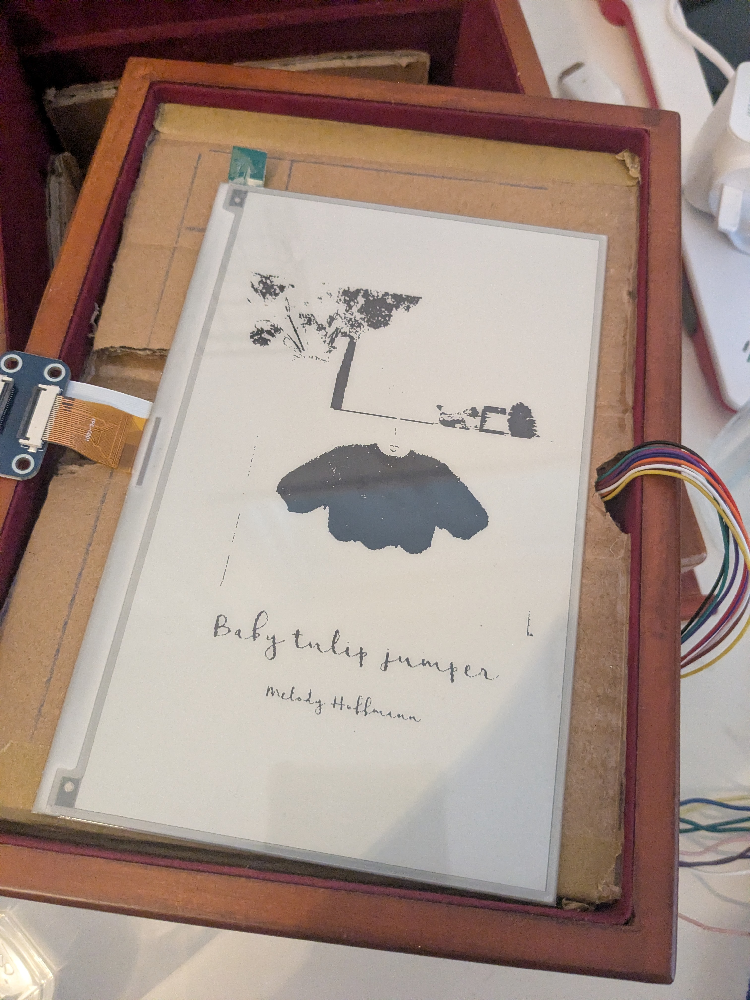{:width="450px"}

### Making it yours

One of the best parts was decorating it and making it personal.

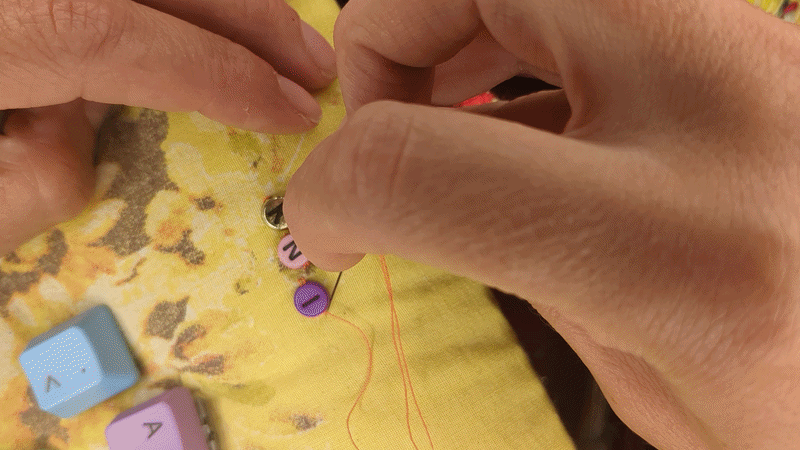{:width="450px"}

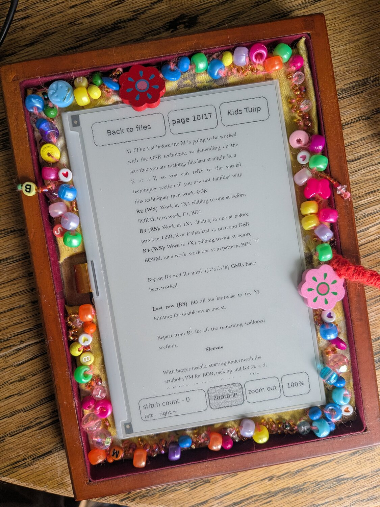{:width="450px"}
