## Knitdeck

Knitdeck is a small cyberdeck built for reading knitting patterns. It shows a pattern on an e-ink screen, and you can turn the pages and hold your place while you knit with mechanical buttons.

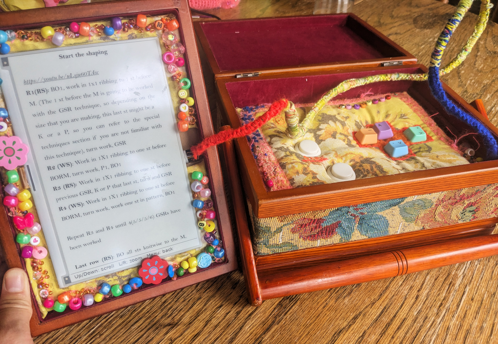{:width="550px"}

### Inspiration

Knitdeck grew out of a love of making and crafts. The aim was to make a cyberdeck that felt like it belonged in the craft world rather than the tech one.

Collecting inspiration is a good start. This is a [Figma](https://www.figma.com) mood board, with references for the look and feel of it.

{:width="550px"}

### Testing the software

The software was added using [SSH](https://projects.raspberrypi.org/en/projects/raspberry-pi-cyberdeck/9).

{:width="550px"}

The software test shows the knitting pattern on the screen and moves through pages of the pattern with the buttons.

{:width="450px"}

Buttons can be tested by connecting a breadboard with buttons to the Raspberry Pi.

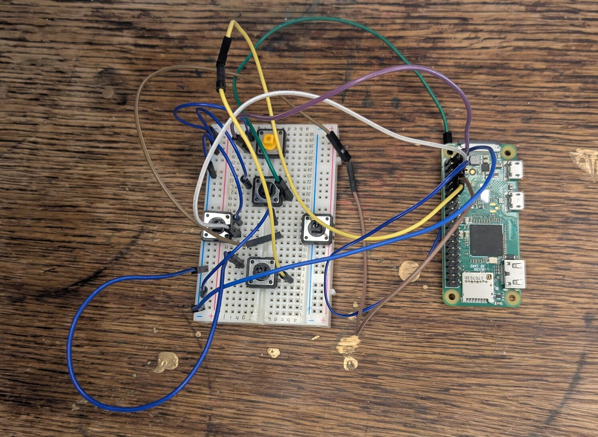{:width="550px"}

Once the parts are tested, it is helpful to draw the final circuit design out. This can be done on paper or by using a tool like [Fritzing](https://fritzing.org).

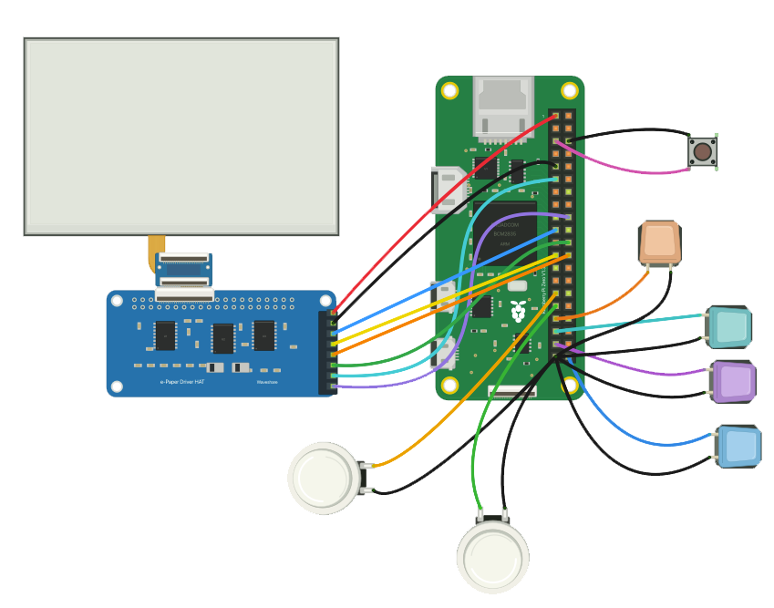{:width="550px"}

### The enclosure

Knitdeck is mounted inside a second-hand sewing box. This kind of box can be found in charity shops and thrift stores. It gives the project a crafty feel.

{:width="550px"}

### Making the control pad

Buttons are mounted onto cardboard. To do this, start by drawing where the parts go.

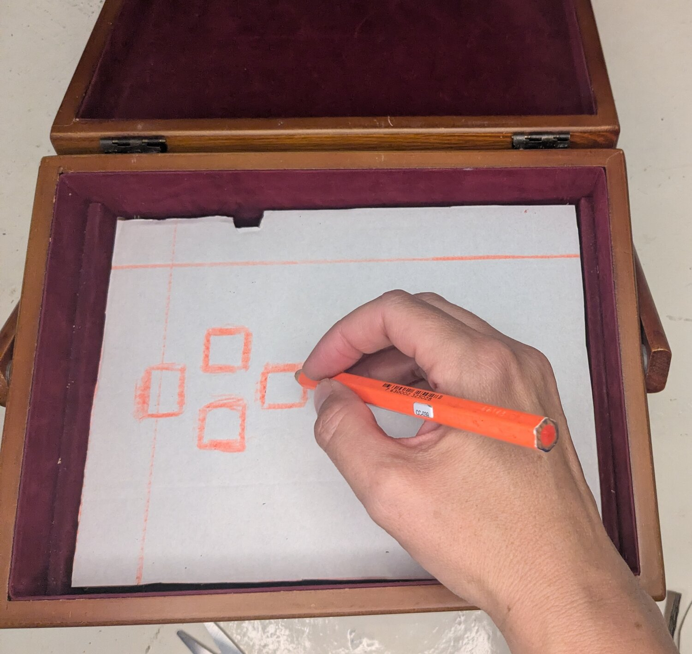{:width="550px"}

Then cut out the holes.

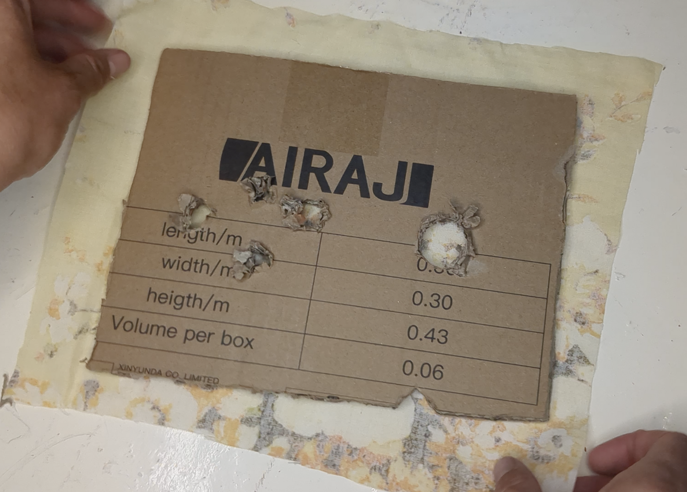{:width="550px"}

Wadding and fabric are added to the card to give it a soft feel.

{:width="550px"}

Cardboard is a great material to use because it is easy to get hold of and can be glued with PVA glue or held together with tape.

{:width="550px"}

Make sure there is enough space to add the Raspberry Pi and wires under the buttons.

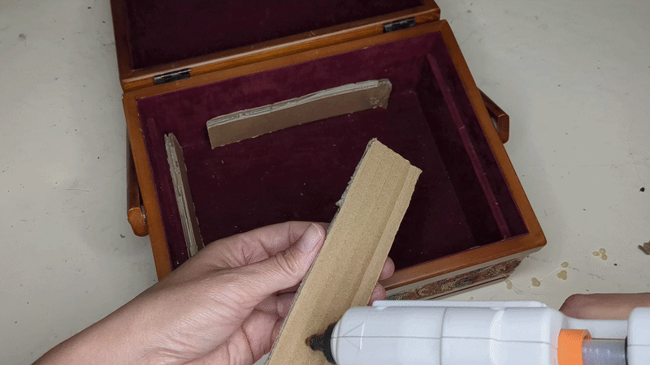{:width="550px"}

### Wiring buttons

Soldering wires onto buttons can be fiddly, and a cyberdeck with a regular keyboard that does not need to be soldered is far simpler.

The order of soldering parts is important. First wires are soldered to the buttons.

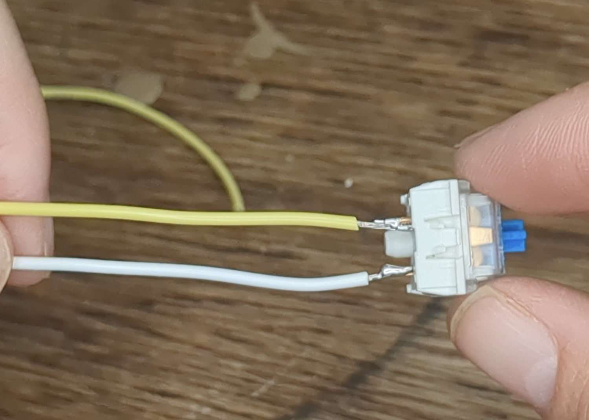{:width="550px"}

Then the wired buttons are threaded through and glued into the cardboard.

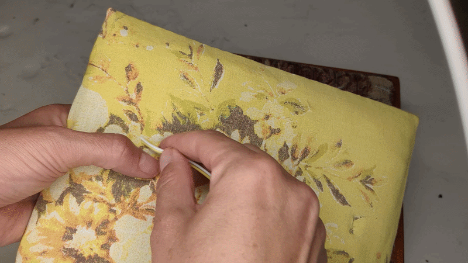{:width="550px"}

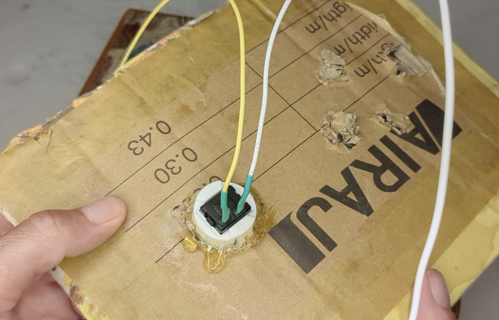{:width="550px"}

{:width="550px"}

### Placing the screen

The screen is positioned in a removable tray that fits inside the box lid.

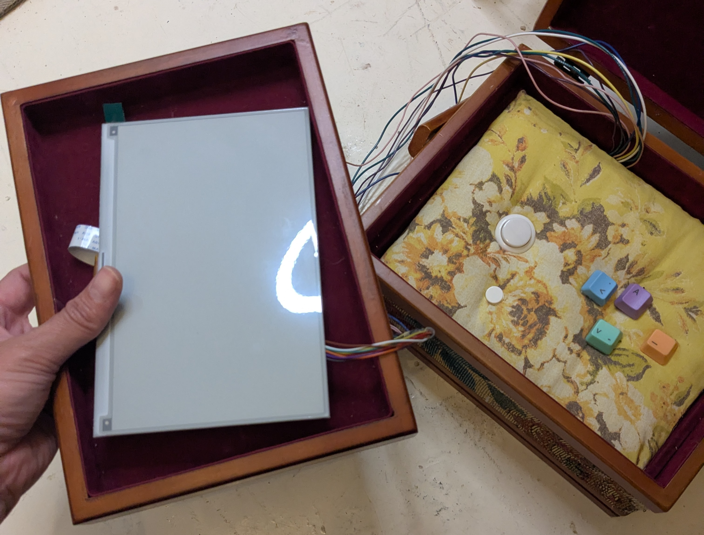{:width="450px"}

It is attached to cardboard, so there is space for the board and wires behind it.

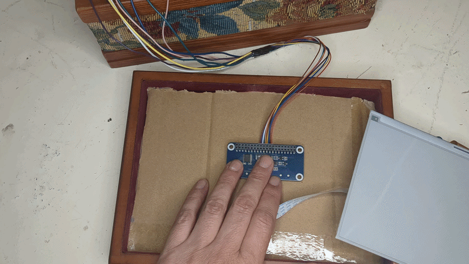{:width="550px"}

{:width="550px"}

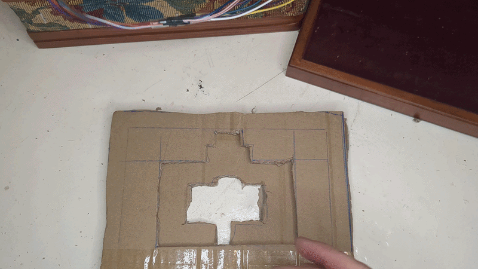{:width="550px"}

### Soldering to a board

The other end of the wires from the buttons and screen are soldered to a perf-board, which is a circuit board with lots of holes in it.

{:width="550px"}

Headers are soldered to the board and connected to the wires.

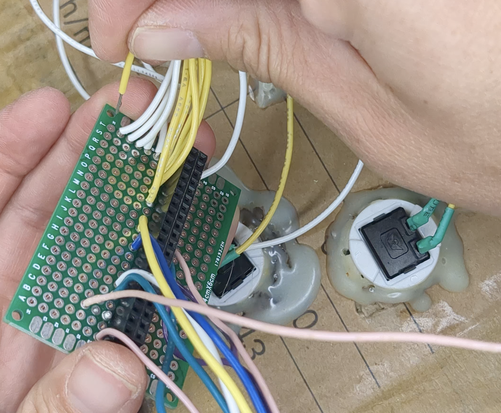{:width="550px"}

This is then plugged into the Raspberry Pi GPIO pins.

There are 6 buttons, and multiple wires for the e-ink screen, so the wiring can look like a bit of a tangle.

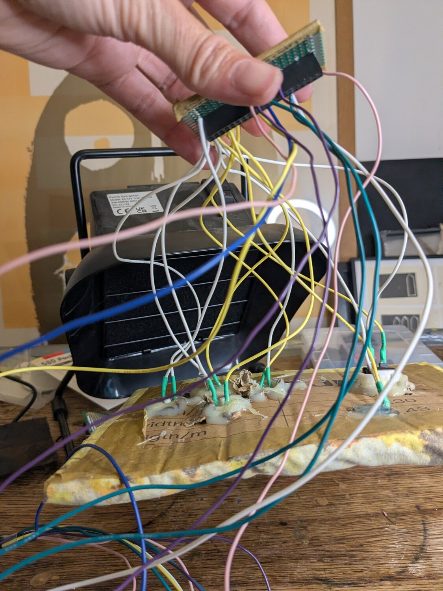{:width="450px"}

### Making it yours

One of the best parts is decorating and making cyberdecks personal.

{:width="550px"}

The Knitdeck is decorated with beads that were sewn into the fabric covering.

{:width="450px"}

Wires are covered using a macramé knotting technique.

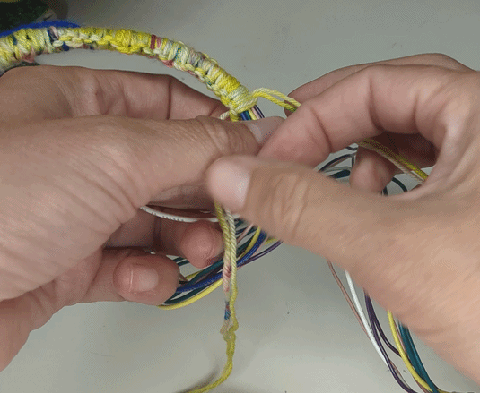{:width="550px"}

Stitching is also used to add colour and texture.

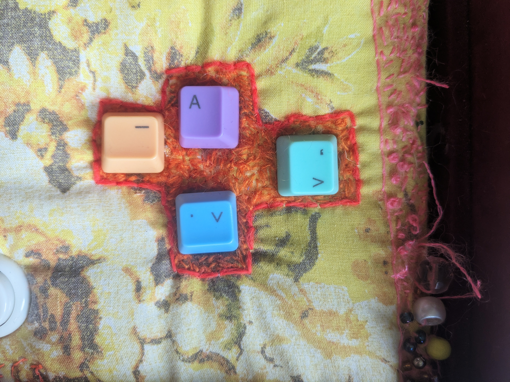{:width="550px"}
