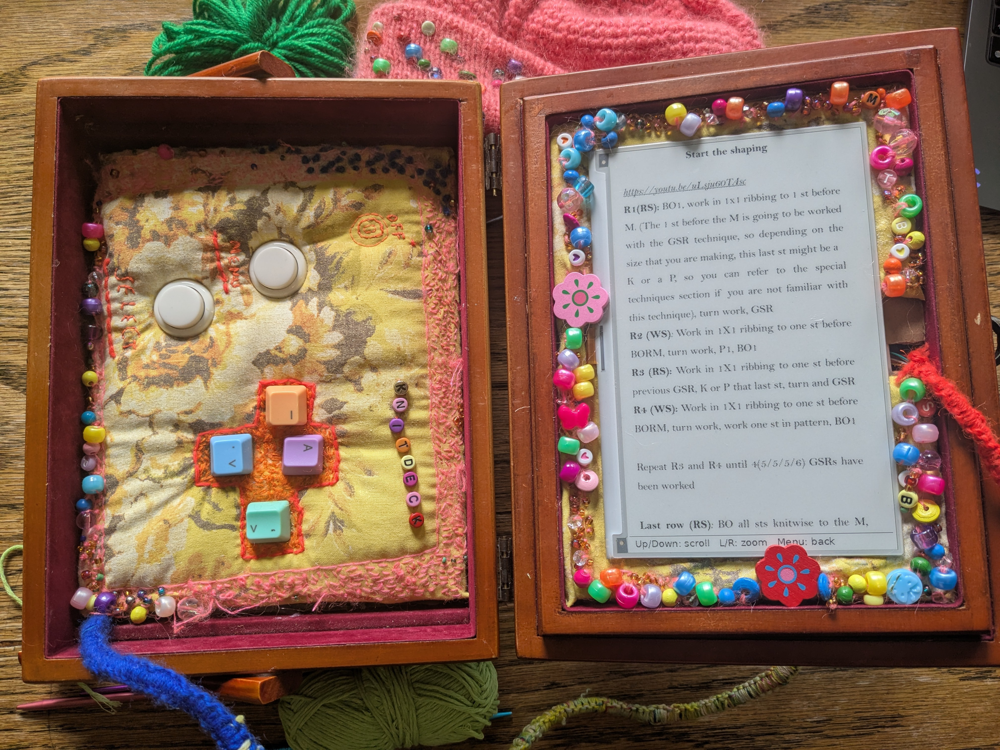
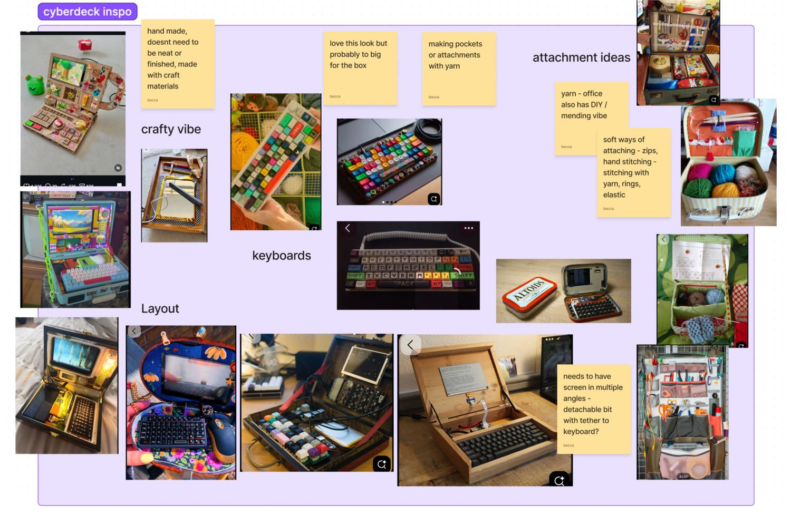
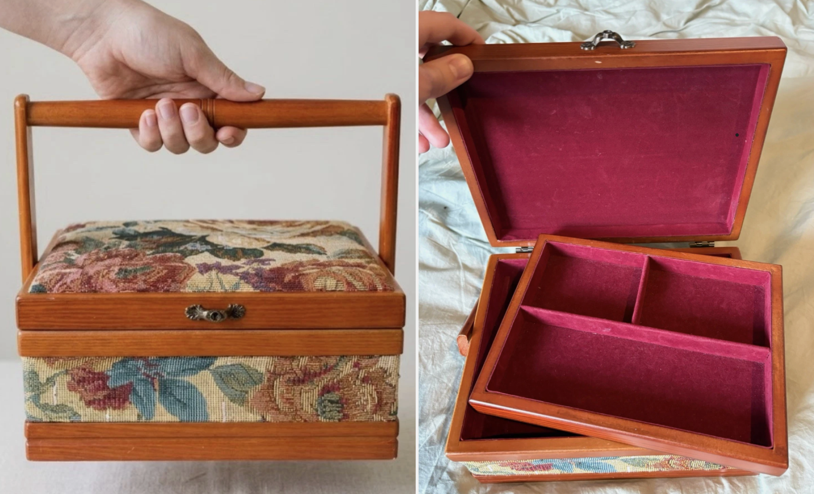
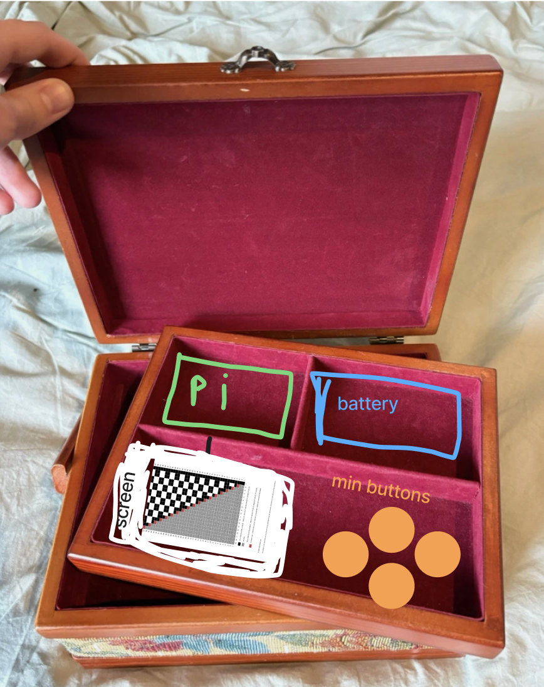

## Knitdeck

Knitdeck is a small cyberdeck built for reading knitting patterns. It shows a pattern on an e-ink screen, and a few buttons turn the pages and hold your place while you knit.

{:width="450px"}

### Inspiration

Knitdeck grew out of a love of making and crafts, and a big pile of knitting patterns. The aim was something simple that felt like it belonged in the craft world rather than the tech one.

This is a figma mood board, of inspiration for the look and feel of it.

{:width="450px"}

### The enclosure

Knitdeck started from an old 1990s sewing box, bought second-hand — the kind that often turns up in charity shops and thrift stores. It already carried the craft feel the project was reaching for.

{:width="450px"}

### Making everything fit

Next is working out how everything fits inside. The first plan was optimistic. 

{:width="450px"}

The real parts needed far more room than expected. Laying the components out by hand, including the battery and the Raspberry Pi, showed what would actually fit and where each piece could go.

{:width="450px"}

### Building it

The inside structure is cardboard. It took a lot of making and adjusting — cutting, testing and trimming pieces until everything sat right.

{:width="450px"}

{:width="450px"}

{:width="450px"}

### Soldering

Soldering was the fiddliest part, and the one that felt most permanent. A build with no buttons is far simpler — even a few buttons adds a tangle of wires to manage.

{:width="450px"}

{:width="450px"}

### The software

The software came together bit by bit, going back and forth with the code. It is a simple program that shows the pattern pages on the screen and moves through them with the buttons.

{:width="450px"}

### Making it yours

One of the best parts was decorating it and making it personal.

{:width="450px"}
