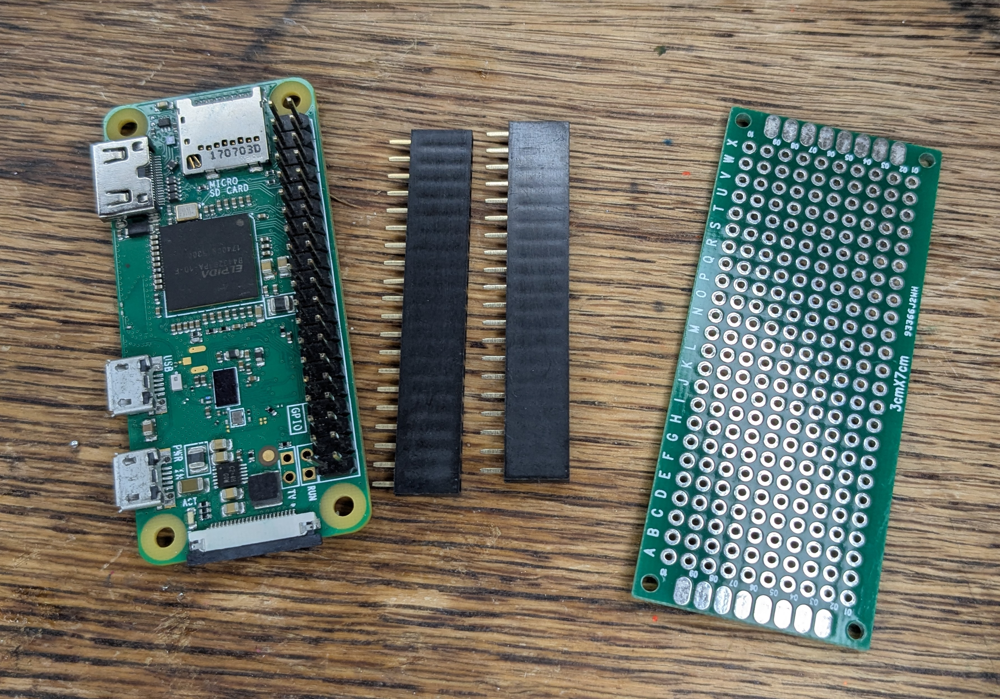

## Knitdeck

Knitdeck is a small cyberdeck built for reading knitting patterns. It shows a pattern on an e-ink screen, and you can turn the pages and hold your place while you knit with mechanical buttons.

{:width="450px"}

{:width="450px"}

### Inspiration

Knitdeck grew out of a love of making and crafts. The aim was to make a cyberdeck that felt like it belonged in the craft world rather than the tech one.

Collecting inspiration is a good start. This is a figma mood board, of references for the look and feel of it.

{:width="450px"}

### The software

The software was added using[add link to ssh page in project ] SSH. It shows the knitting pattern on the screen and moves through pages of the pattern with the buttons.

{:width="450px"}

### Testing

The screen and buttons were tested with the software before the cyberdeck was assembled. 

{:width="450px"}

Buttons can be tested by connecting a breadboard with buttons to the Raspberry Pi.

{:width="450px"}

Once the parts are tested, it is helpful to draw the circuit out. This can be done on paper or by using a tool like Frizing (add link).

{:width="450px"}

### The enclosure

Knitdeck is mounted inside a second hand sewing box. This kind of box can be found in charity shops and thrift stores. It gives the project a crafty feel.

{:width="450px"}

### Adding buttons

Buttons are mounted onto cardboard. Draw where the parts go first.

{:width="450px"}

Then cut out.

{:width="450px"}

Wadding and fabric are added to the card to give it a soft feel.

{:width="450px"}

Cardboard is a great material to use because it is easy to get hold of and can be glued with PVA glue or held together with tape.

{:width="450px"}

Make sure there is enough space to add the Raspberry Pi and wires under the buttons.

{:width="450px"}

### Soldering

Soldering can be fiddly, and a cyberdeck with a regular keyboard that does not need to be soldered is far simpler.

The order of soldering parts is important. First wires are soldered to the buttons.

{:width="450px"}

Then buttons are a glued into the cardboard.

{:width="450px"}

{:width="450px"}

Finally wires from the buttons are soldered.

Wires are soldered to a circuit board, then headers used to connect to the Raspberry Pi GPIO pins.

{:width="450px"}

{:width="450px"}

{:width="450px"}

There a 6 buttons, and multiple wires for the e-ink screen, so once soldered into place, the wiring can look like a tangle. 

{:width="450px"}

### Placing the screen

The screen is attached to a cardboard surface, so there is space for the boards and wires behind it.

{:width="450px"}

### Making it yours

One of the best parts is decorating and making cyberdecks personal. The knitdeck was decorated with beads, that were sewn into the fabric covering.

{:width="450px"}

{:width="450px"}

Wires were covered using a macrame knotting technique.

{:width="450px"}