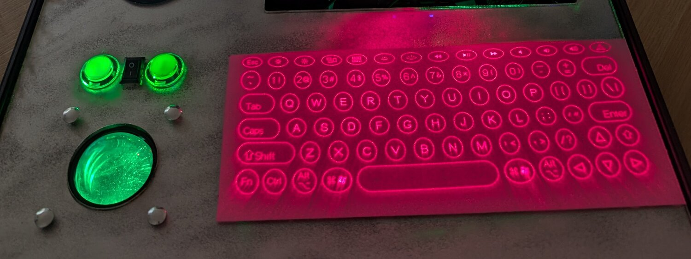

## Sideband

Sideband starts with familiar parts — a Raspberry Pi, a screen and a keyboard — and folds
them into a sealed hard case about the size of a large briefcase.

It is also a modern, tongue-in-cheek take on the cyberspace decks imagined by
William Gibson. His 1984 novel *Neuromancer* follows Case, a hacker who uses a specialised
*cyberspace deck* to enter the matrix: a shared, computer-generated world built from
networks and data. The book helped define the cyberpunk genre.

Here, that Gibsonesque idea becomes physical: a rugged, ready-to-go cyberpunk rig, part
field terminal and part spacecraft console. Its screens, switches and network activity
stay on show, so the systems used to teach cybersecurity can be seen at work.

It is not the smallest, lightest or most practical way to package a computer. That is the
point. It is not a prop, either: the Pi, tablets and other connected devices form a working
private LAN.

The system is designed to work mostly offline. When an authorised hacking task needs
internet access, the main computer can use a controlled route while the private network
of tablets and test devices remains off the public internet.

{:width="450px"}

Beneath the deck, a Raspberry Pi 5 with 8GB of memory and a cooling system runs Raspberry
Pi OS and hosts Sideband's local services.

### The case and display

The hard case doubles as the chassis. A moulded lip around the inside supports the 5mm cast
acrylic deck directly, so it needs no separate frame. The panel is painted silver on the
back and cut to 440mm by 296mm, with openings for the controls, sockets and storage slots
laser-cut into the same piece.

The main display was salvaged from a pi-topCEED, an older Raspberry Pi desktop kit found in
a dusty store cupboard. It is mounted on an acrylic panel in the lid, with its
power-management board behind it.

Retaining the original display electronics leaves its power supply and button separate
from the Raspberry Pi. As a useful side effect, the screen can be switched off while the
computer and its background services carry on running.

### Making room for input

The keyboard projector began as Kickstarter-backed hardware, then sat unused for years.
It now casts a keyboard across the acrylic in red laser light. An infrared sensor detects
each key press, and the projector sends the keystroke to the Raspberry Pi over Bluetooth.
When the case is packed, it slips into its own storage slot.

A conventional mouse needs a clear surface, room to move and somewhere to be stowed. A
trackball needs none of that. It also looks at home on a spaceship or an arcade machine,
which suits Sideband.

The two illuminated arcade buttons above the ball provide its left and right mouse clicks.
The trackball also supplies power to their lights, and the whole assembly reaches the
Raspberry Pi as one USB device through a PS/2-to-USB adapter.

{:width="450px"}

### Controls and switches

Sideband has eight physical controls: four for lighting, two for pointer input, a key-lock
mode switch and a safe shutdown button.

The key-lock switch selects between two roles. One position provides a normal Raspberry Pi
OS workstation; the other turns Sideband into the console for a beginner-friendly local
penetration-testing game, with its interface extending across both tablets. The game
itself is still in development.

Shutdown is deliberately harder to trigger. A tap does nothing; only a sustained press
asks Raspberry Pi OS to shut down cleanly. The button never cuts power directly, reducing
the risk of corrupting data on the microSD card.

+ **Key-lock switch** — changes between the Raspberry Pi OS desktop and game mode
+ **Shutdown button** — asks Raspberry Pi OS to shut down after a long press
+ **Mode button** — moves the lighting to its next pattern
+ **Brightness dial** — changes the brightness of the lighting
+ **Blackout switch** — turns off the main decorative lighting without cutting power to the
  Raspberry Pi
+ **Lamp switch** — turns on the lights beneath the arcade buttons
+ **Two arcade buttons** — work as the trackball's left and right mouse buttons

{:width="450px"}

### Side displays

The two 7-inch Android tablets were previously used at Raspberry Pi Foundation events for
audience quizzes and forms. They are now too old for modern apps, but their screens remain
perfectly useful as local dashboards.

The Raspberry Pi hosts their private Wi-Fi network and serves a different local website to
each tablet. The interfaces therefore work at home, at school or at an event without
depending on venue Wi-Fi. Only explicitly allowed devices can join this closed lab
network.

In workstation mode, one tablet shows temperature, memory and storage use, while the other
reports current network connections, Wi-Fi signal strength and connection details. In
game mode, that division disappears: both become part of the game display, showing tasks,
notes and local network information such as connected devices.

{:width="450px"}

The tablets report information rather than providing general-purpose remote access.
Neither can type into or control the Raspberry Pi desktop.

When Sideband is packed, both tablets slide edge-on into a slot in the deck surface, where
they also charge.

### Lighting and power

Lighting doubles as interface and theatre. Two grids of colour LEDs sit below the acrylic,
illuminating control labels etched through the silver paint on its underside. An onboard
Raspberry Pi Pico W drives both grids. Some modes signal error states; others simply make
startup look properly futuristic.

Either tablet can adjust the grids through its local control panel, while the physical
mode button and brightness dial remain available at the deck. The hardware blackout
switch cuts the main decorative lighting immediately, so going dark does not depend on
software. A separate lamp switch handles the arcade-button lights.

Apart from the grids, a circular LED board illuminates the lid indirectly. It faces the
mirrored surface behind the display, spreading a soft glow across the panel without direct
glare.

The entire rig uses a single mains lead. Inside the case, a switched extension
distributes power to four adapters: one for the Raspberry Pi, one for the main display,
one for the LED lighting, and one USB charger for the tablets and smaller boards. The system
is self-contained rather than cordless: it travels as one case and plugs in when opened.

{:width="450px"}
