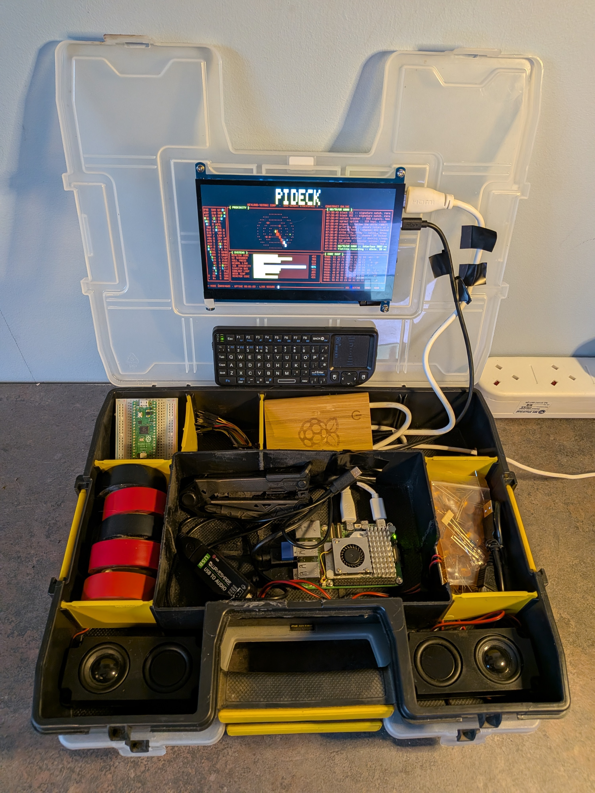
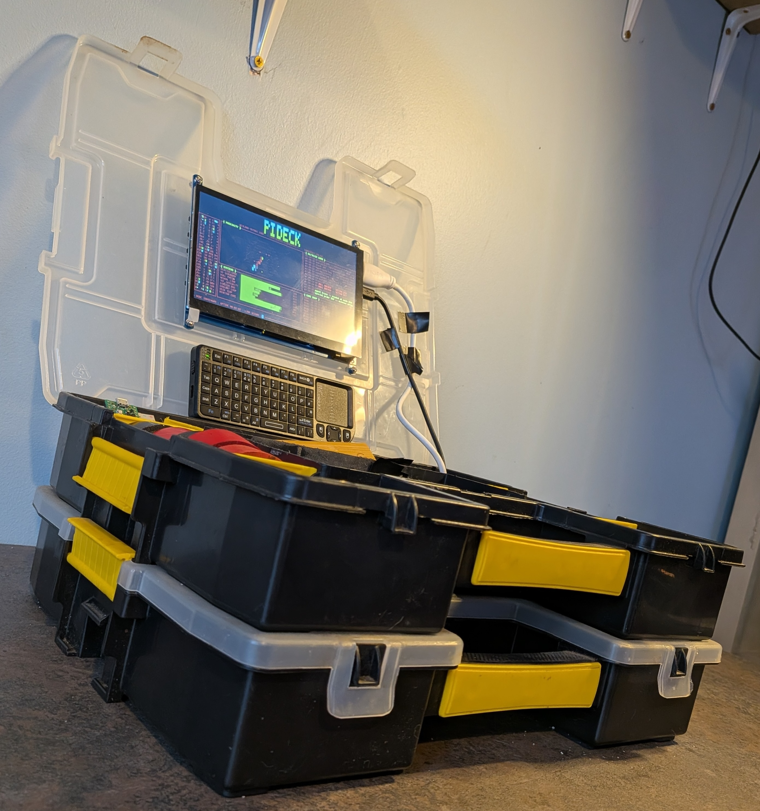
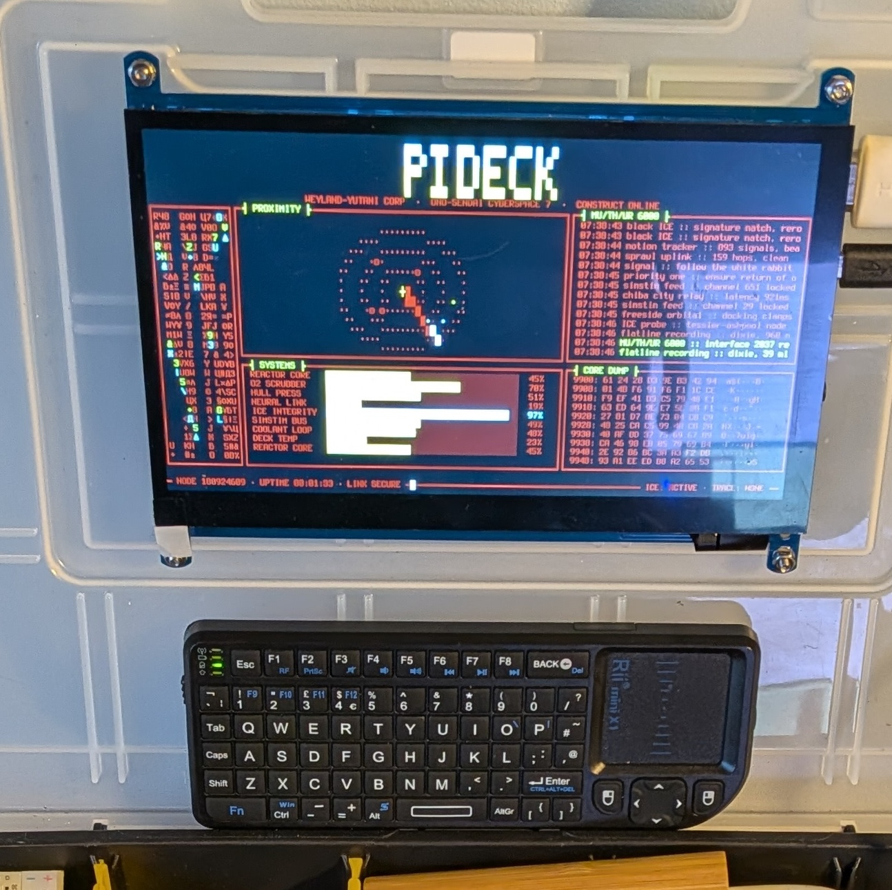
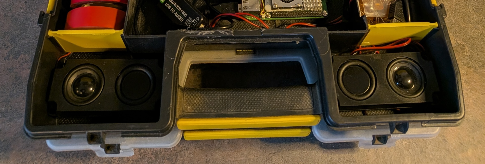
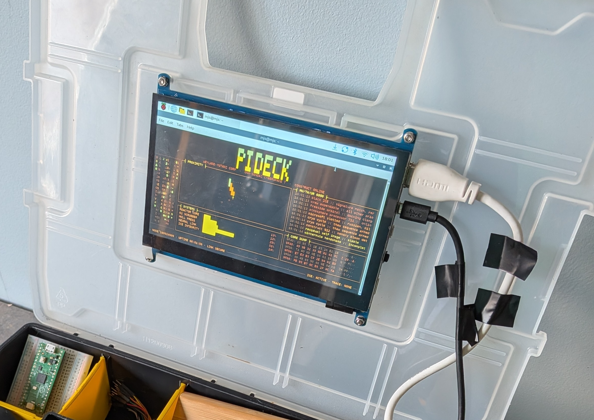
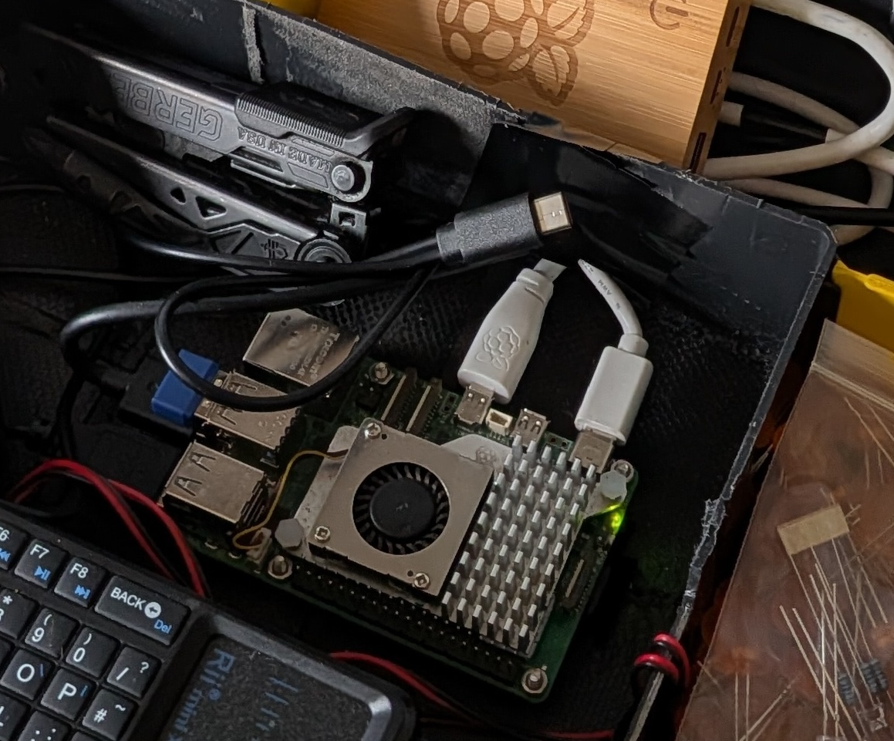
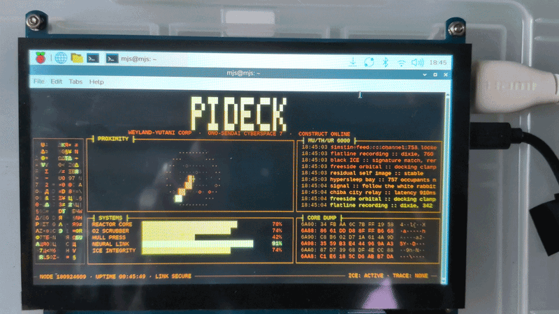

## Toolbox terminal

It is not polished. It manages about forty-five minutes on a battery, and the lid does not quite close over the cables. But it plays music and runs a terminal, and it is unmistakably its maker's, which is the whole point.

{:width="550px"}

Toolbox terminal is built into a component box, the kind with a hinged lid and moulded compartments.

{:width="550px"}

## Devices

Two things were bought for it. A tiny Bluetooth keyboard, because nothing else would fit,

{:width="550px"}

and a pair of speakers, because it had to be loud. 

{:width="550px"}

## Cable management

Add something about cable management and cutting holes in and usign tape

{:width="550px"}

{:width="550px"}

## Software

Add something about the look and feel of the case being refelted in the software and abotu what it does.

{:width="550px"}

