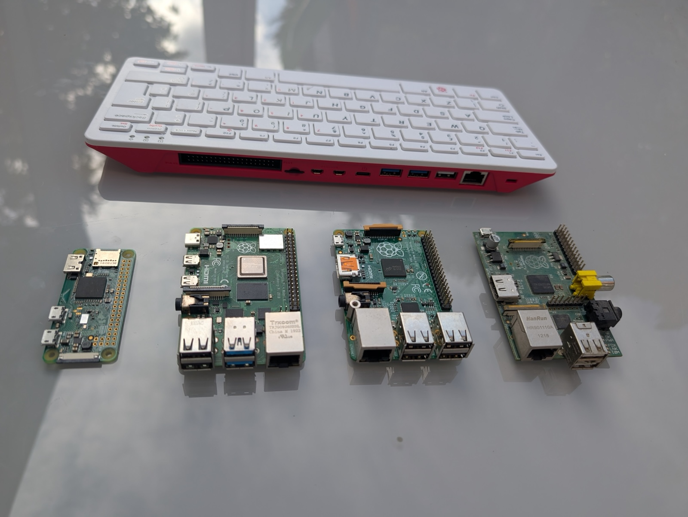

## Choose a Raspberry Pi

Most cyberdecks are built around a Raspberry Pi. Several models work well.

{:width="450px"}

**Raspberry Pi 5** is the fastest. It needs the most power.

**Raspberry Pi 4** is quick enough, and easy to find secondhand.

**Raspberry Pi 400/500** puts a Pi 4/5-class computer inside a keyboard, so part of the build is
already done.

**Raspberry Pi Zero boards** are tiny and easy to run from a power bank. Their sockets are
smaller, and the original Zero in the photograph is much slower than the Zero 2 W.

**Older models** work too.

> [!TASK]
>
> Pick your Raspberry Pi. Think mostly about how it will get its power:
>
> Plugging into mains power means any model will work if you have the right power supply.
> For a battery or portable power bank, a Zero is probably your best bet.
