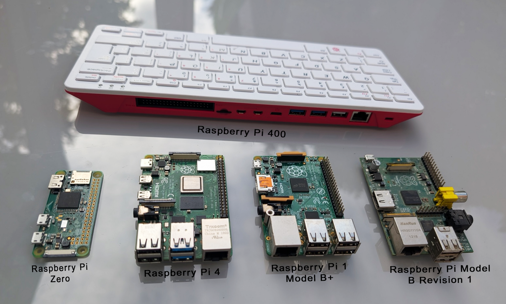

## Choose a Raspberry Pi

Most cyberdecks are built around a Raspberry Pi.

Choosing your Raspberry Pi depends on what you want to do with your cyberdeck. Several models work well as desktop computers, some of the older ones are a bit slower. 

{:width="450px"}

**Raspberry Pi 5** is the fastest. It needs the most power.

**Raspberry Pi 4** is quick enough, and easy to find secondhand.

**Raspberry Pi 400/500** puts a Pi 4/5-class computer inside a keyboard, so part of the build is already done.

**Raspberry Pi Zero boards** are tiny and easy to run from a power bank. Their sockets are smaller, and the original Zero in the photograph is much slower than the Zero 2 W available now.

**Older models** work too.

> [!TASK]
>
> Pick your Raspberry Pi. Choose based on what you have available, or based on what your cyberdeck needs.

> [!TASK]
>
> Think about how you will power it.
>
> Plugging into mains power means any model will work. You will need to check which power supply it needs.
>
> A Zero is best if you want it to be battery powered or use a portable power bank.
