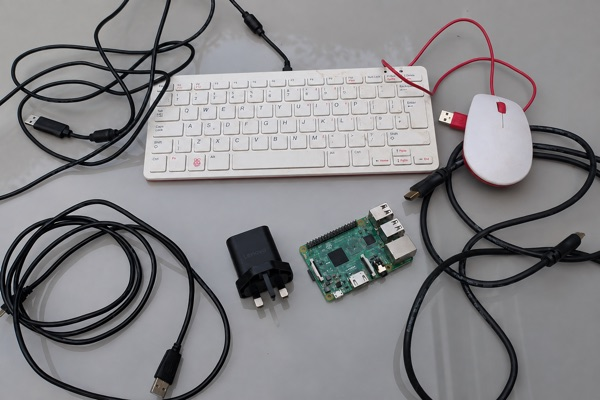
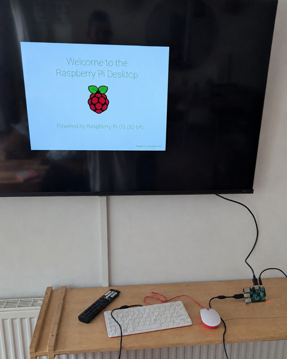

## Plugging in

A Raspberry Pi is a complete computer, just without a screen, keyboard or speakers.

{:width="450px"}

A Raspberry Pi computer needs four things to get it running:

**Power** — the connector and power supply depend on the model.

**A microSD card** — the software lives here.

**A display** — plugs into the HDMI socket.

**A keyboard (and optional mouse)** — plugs into a USB socket.

Use the ticks to match each Raspberry Pi model to its power and HDMI connectors.

| Model |  Micro-USB power |  USB-C power |  Full-size HDMI |  Mini HDMI |  Micro HDMI |
|---|:---:|:---:|:---:|:---:|:---:|
| Raspberry Pi 1 (all models) | ✓ | — | ✓ | — | — |
| Raspberry Pi 2 Model B | ✓ | — | ✓ | — | — |
| Raspberry Pi 3 (all models) | ✓ | — | ✓ | — | — |
| Raspberry Pi Zero (all models) | ✓ | — | — | ✓ | — |
| Raspberry Pi 4 Model B | — | ✓ | — | — | ✓ 2 ports |
| Raspberry Pi 5 | — | ✓ | — | — | ✓ 2 ports |
| Raspberry Pi 400 | — | ✓ | — | — | ✓ 2 ports |
| Raspberry Pi 500 | — | ✓ | — | — | ✓ 2 ports |
| Raspberry Pi 500+ | — | ✓ | — | — | ✓ 2 ports |

> [!TIP]
>
> Raspberry Pi Zero boards have two Micro-USB sockets. Connect power to the one labelled
> **PWR IN**; the other is for USB devices.

### Match the power supply

A plug that fits is not always powerful enough. Use the recommended values below. The
voltage must match. A higher current rating at 5 V is fine because the Raspberry Pi only
draws the current it needs.

| Model | Voltage | Recommended current |
|---|:---:|:---:|
| Raspberry Pi 1 (all models) | 5 V | 2.5 A |
| Raspberry Pi 2 Model B | 5 V | 2.5 A |
| Raspberry Pi 3 (all models) | 5 V | 2.5 A |
| Raspberry Pi Zero (all models) | 5 V | 2.5 A |
| Raspberry Pi 4 Model B | 5 V | 3 A |
| Raspberry Pi 5 | 5 V | 5 A |
| Raspberry Pi 400 | 5 V | 3 A |
| Raspberry Pi 500 | 5 V | 5 A |
| Raspberry Pi 500+ | 5 V | 5 A |

> [!TIP]
>
> Some good-quality phone chargers can power Raspberry Pi 4, Raspberry Pi 400 and older
> models, but only if the small **Output** text lists **5 V** and at least the current shown
> in the table. The cable must also be suitable and have the correct plug. A large wattage
> at 9 V, 12 V or 20 V does not replace the required 5 V output. If you are unsure, use the
> official power supply for the Raspberry Pi model.
>
> For Raspberry Pi 5, 500 or 500+, use a **5 V, 5 A** USB-C power supply. Raspberry Pi 5
> and 500 can run from a good-quality **5 V, 3 A** supply with low-power accessories, but
> all their USB devices together are limited to **600 mA**. Even a high-wattage phone or
> laptop charger may not provide the required 5 V, 5 A setting.

> [!TASK]
>
> Look at your Raspberry Pi. Check which power connector it has, how many USB sockets, and what size the HDMI socket is.
>
> Gather what you have. Make a list of anything missing.
>
> {:width="400px"}

> [!TIP]
>
> A Raspberry Pi can run with no display and no keyboard at all. Raspberry Pi Connect and SSH do that, later in this project.

{:width="300px"}
