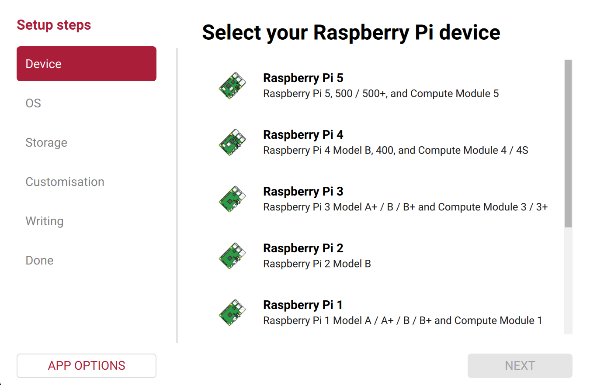

## Install Raspberry Pi OS

**Raspberry Pi OS** is the software that turns the board into a computer. It goes onto the microSD card.

{:width="450px"}

> [!TASK]
>
> Find your microSD card. Any card of 16GB or more works.
>
> Find a way to plug it into your computer. Some laptops have a slot. Others need a USB card reader.

> [!TASK]
>
> Install **Raspberry Pi Imager** from [raspberrypi.com/software](https://www.raspberrypi.com/software/).
>
> Open it, and put your card in.

{:width="450px"}

> [!TASK]
>
> Use the three buttons to choose your **device**, your **operating system**, and your **storage**.
>
> Pick Raspberry Pi OS (64-bit). Check the storage is your card, not a hard drive.

> [!INFO]
>
> Writing erases everything on the card. There is no undo.

**Test:** All three buttons show your choices.

> [!TASK]
>
> Click **Next**, then edit the settings.
>
> Set a **hostname**, a **username** and a **password**. Add your wi-fi details. Under **Services**, turn on **SSH**.

{:width="450px"}

> [!TIP]
>
> The hostname is the name your cyberdeck answers to. Pick one you like typing.
>
> Write the username and password down. Nobody can recover them for you.

> [!TASK]
>
> Save, and let Imager write the card.
>
> Take the card out when it finishes.

**Test:** Imager says the write was successful.

> [!DEBUG]
>
> Imager cannot see the card? Take it out, put it back, and click **Choose storage** again.
>
> Write failed partway? Try a different card reader. Readers fail more often than cards.
