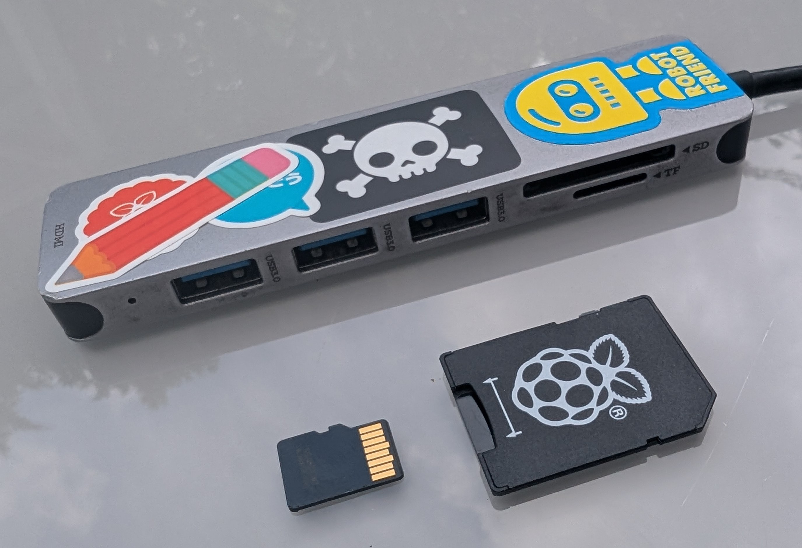
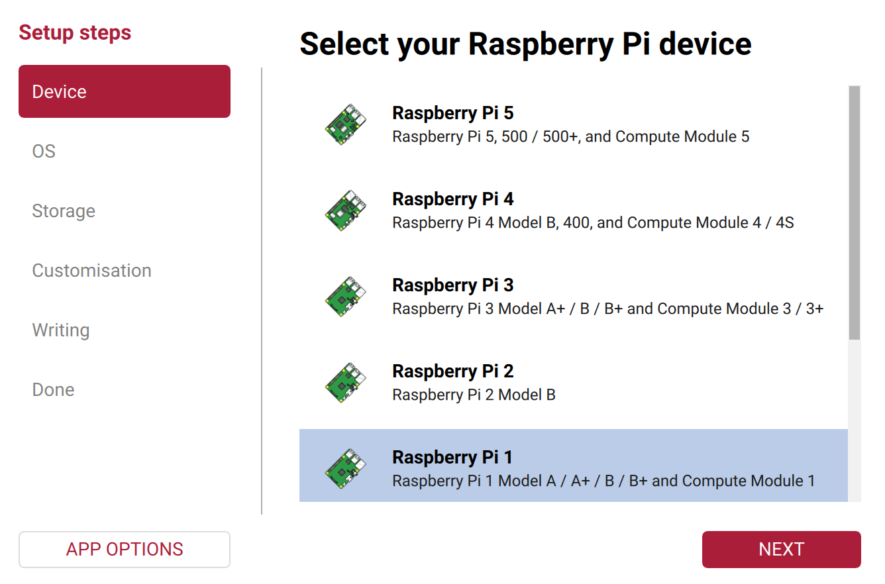
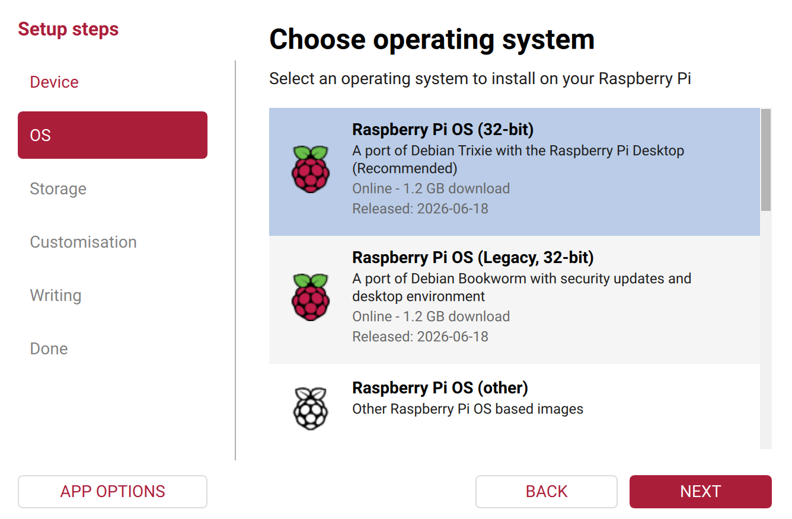
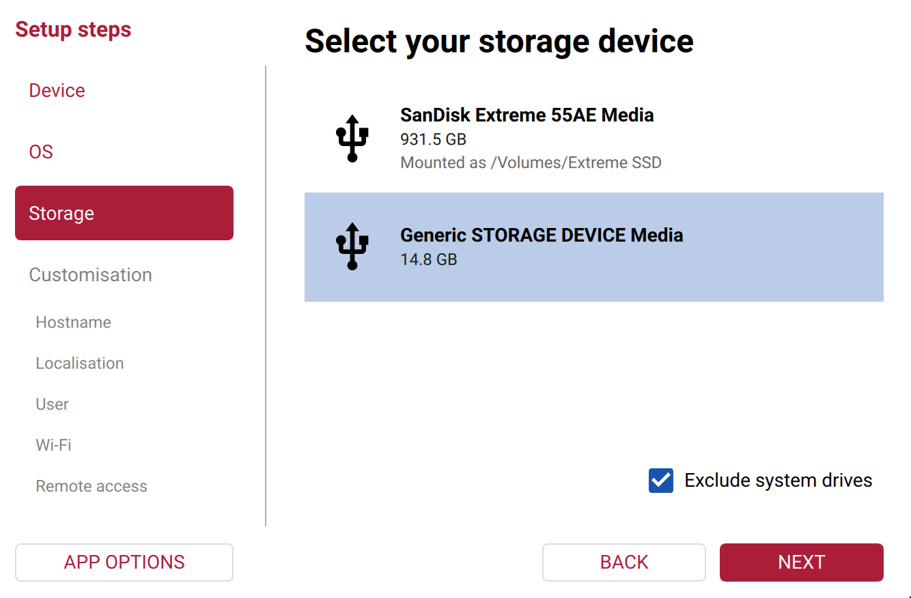
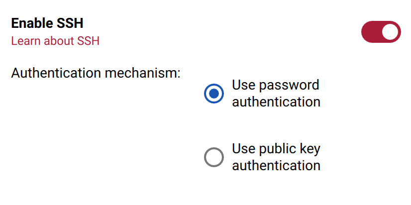
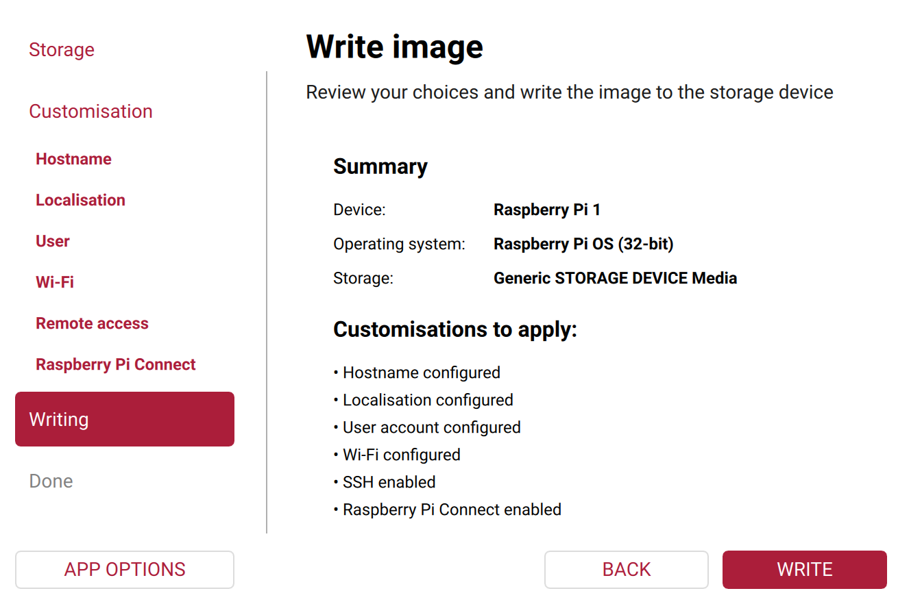
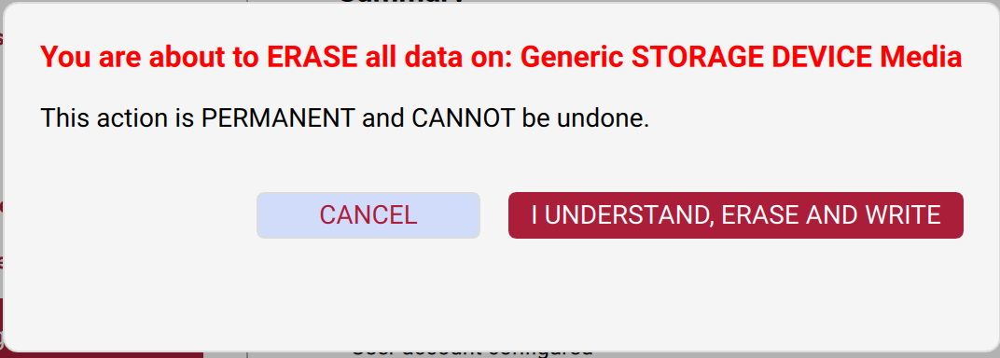

## Install Raspberry Pi OS

**Raspberry Pi OS** is the software that turns the board into a computer. It goes onto the microSD card.

{:width="450px"}

> [!TASK]
>
> Find your microSD card. Any card of 16GB or more works.
>
> Find a way to plug it into your computer. Some laptops have a slot. Others need a USB card reader.

> [!TASK]
>
> Install **Raspberry Pi Imager** from [raspberrypi.com/software](https://www.raspberrypi.com/software/).
>
> Open it, and put your card in.

{:width="450px"}

> [!TASK]
>
> Choose the **Raspberry Pi model** you have, then click **Next**.

{:width="450px"}

> [!TASK]
>
> Choose the version of **Raspberry Pi OS** marked **Recommended**, then click **Next**.
> The exact version depends on your Raspberry Pi model, so it may differ from the example.

{:width="450px"}

> [!TASK]
>
> Choose the microSD card you are writing Raspberry Pi OS to. Keep
> **Exclude system drives** ticked, and check the card's size before you continue.

{:width="450px"}

> [!INFO]
>
> Writing erases everything on the card. There is no undo.

**Test:** The **Device**, **OS** and **Storage** steps show your choices.

> [!TASK]
>
> Click **Next**, then edit the settings.
>
> Set a **hostname**, a **username** and a **password**. Add your **wi-fi details**. Under
> **Remote access**, turn on **SSH** and choose **Use password authentication**.

{:width="400px"}

> [!TIP]
>
> The hostname is the name your cyberdeck answers to on your network. Pick one that is
> easy to type and makes it recognisable.
>
> Make sure you remember the username and password! **Nobody can recover them for you if you forget.**

### Optional: set up Raspberry Pi Connect

**Raspberry Pi Connect** lets you securely open your Raspberry Pi's desktop or command
line in a web browser, even when you are away from it.

> [!TASK]
>
> In Imager, open the **Raspberry Pi Connect** settings and turn on
> **Enable Raspberry Pi Connect**. Then click **Open Raspberry Pi Connect**.
>
> Your browser will open. Sign in with your **Raspberry Pi ID**, or create an account if
> you do not have one, then follow the instructions to return to Imager.

> [!TASK]
>
> Review the device, operating system, storage and customisations. If they are correct,
> click **Write**.

{:width="450px"}

> [!TASK]
>
> Check the storage device one last time. If it is the microSD card, click
> **I understand, erase and write**.
>
> Let Imager write and verify the card, then take it out when it finishes.

{:width="450px"}

**Test:** Imager says the write was successful.

> [!DEBUG]
>
> Imager cannot see the card? Take it out, put it back, and click **Choose storage** again.
>
> Write failed partway? Try a different card reader. Readers fail more often than cards.
