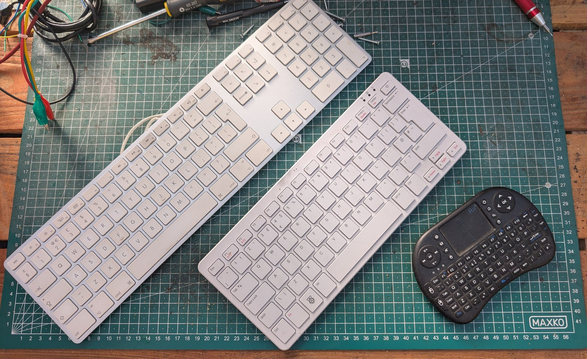
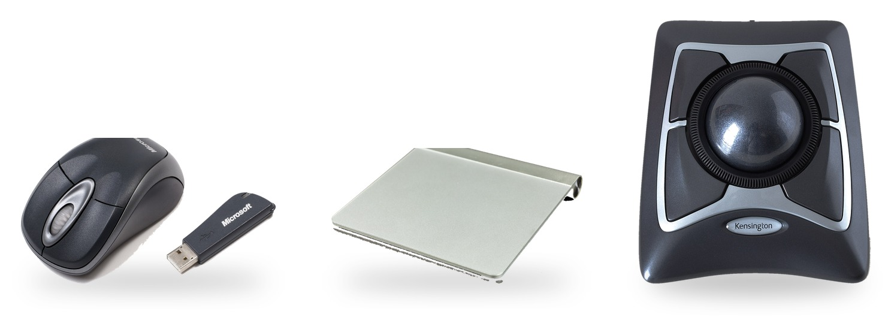

## Choose input devices

**Input devices** such as a keyboard or mouse give you a way to interact with your cyberdeck.

{:width="550px"}

### Keyboards

A **full-size keyboard** is quite wide, but you can get foldable versions to save space.

**Compact keyboards** save space because they have smaller layouts and combine or remove keys.

A **mini keyboard with a built-in trackpad** is one small unit, although the tiny keys might not be easy to use.

{:width="550px"}

### Pointers

A **mouse** is familiar to use and precise, but it needs a flat surface and some room to move it.

**Trackpads or trackballs** stay in one place, which makes either one easier to build into a compact case. 

**A touchscreen** can replace a separate pointing device for many jobs.

**Buttons and joysticks** can make a finished cyberdeck look brilliant, but you will need to use a keyboard while you build and test it.

{:width="550px"}

> [!TASK]
>
> Start with input devices you already have. 
>
> Lay the devices where they will go on the finished case might. Check that they will fit, and leave room for the screen, plugs and cables.

*Pointing device photos, combined and placed on a plain background: [Microsoft wireless mouse](https://commons.wikimedia.org/wiki/File:Microsoft-wireless-mouse.jpg) by Evan-Amos, public domain; [Apple Magic Trackpad](https://commons.wikimedia.org/wiki/File:Apple_Magic_Trackpad-3881.jpg) © Raimond Spekking, [CC BY-SA 4.0](https://creativecommons.org/licenses/by-sa/4.0/); [Kensington Expert Mouse trackball](https://commons.wikimedia.org/wiki/File:Kensington_Expert_Mouse_Wired_Trackball_64325.jpg) © Bobulous, [CC BY-SA 4.0](https://creativecommons.org/licenses/by-sa/4.0/). All via Wikimedia Commons.*
