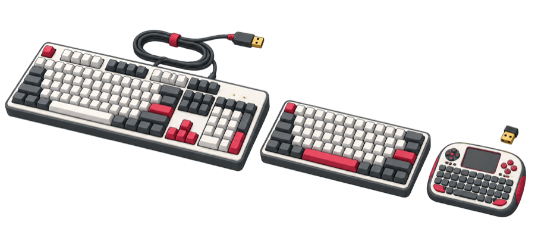
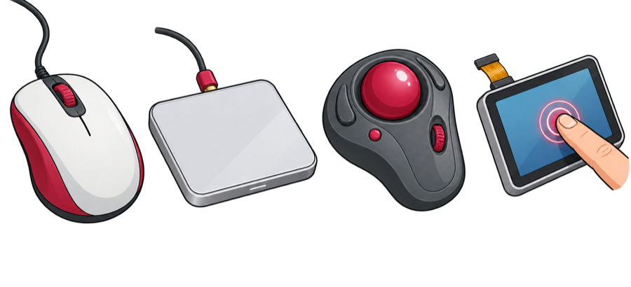

## Choose input devices

**Input devices** such as a keyboard or mouse give you a way to interact with your cyberdeck.

> [!TASK]
>
> Start with input devices you already have. 
>
> Lay the devices where they will go on the finished case might. Check that they will fit, and leave room for the screen, plugs and cables.

### Keyboards

A **full-size keyboard** is quite wide, but you can get foldable versions to save space.

**Compact keyboards** save space because they have smaller layouts and combine or remove keys.

A **mini keyboard with a built-in trackpad** is one small unit, although the tiny keys might not be easy to use.

{:width="550px"}

### Pointers

A **mouse** is familiar to use and precise, but it needs a flat surface and some room to move it.

**Trackpads or trackballs** stay in one place, which makes either one easier to build into a compact case. 

**A touchscreen** can replace a separate pointing device for many jobs.

**Buttons and joysticks** can make a finished cyberdeck look brilliant, but you will need to use a keyboard while you build and test it.

{:width="550px"}

### Connecting input devices

Using **wired USB** for your pointer and keyboard is dependable and needs no batteries, but a separate keyboard and mouse usually use two sockets.

Some keyboards have a **built-in USB hub**. With this you can plug the mouse into the keyboard to keep one Raspberry Pi socket free.

A **wireless USB receiver** uses one socket for both a keyboard and mouse, and saves space.

**Bluetooth** can keep the USB sockets completely free, but the devices need pairing and power. Also, Raspberry Pi models without built-in Bluetooth would need a USB Bluetooth adaptor.
