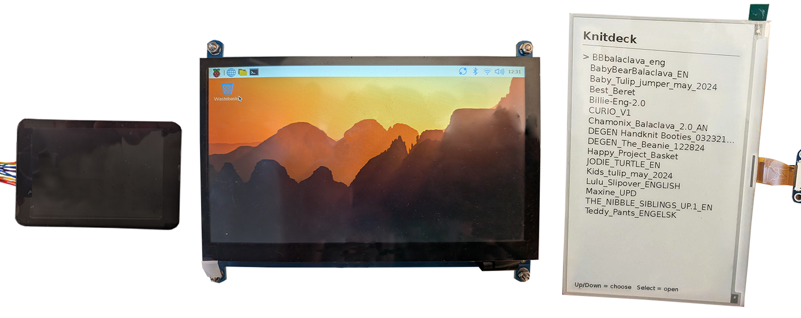

## Choose a display

Choose a screen based on what you want to do with your cyberdeck. 

{:width="450px"}

A **small screen** from about 3 inches upwards will work. Most need a USB cable for power.

The **Raspberry Pi Touch Display** connects by ribbon cable instead of HDMI, so it keeps the HDMI socket free. Its touchscreen can replace a separate mouse.

A black and white **e-paper** looks like a page of a book and uses almost no power. It redraws slowly, and is good for reading, not good for video or games.

> [!TASK]
>
> Source a display that can be attached for your deck and make sure it fits with your case.

> [!TIP]
>
> - Some screens take **power** from the Raspberry Pi, others need their own supply.
> - Some menus will not work with low **resolution** screens that are below 800px by 480px.
