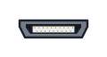
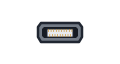

## Choose a display

The display shapes the build more than anything else.

**An ordinary monitor** is the one to start with. Too big for a case, but it makes setting up easy.

**A nearby television or projector** can do the job too. If it has an HDMI input, connect
the right cable and select that input. That changes the build: instead of carrying a
display, your cyberdeck borrows one from the room. Pack the cable, though—a handy screen
will not always be available.

**A small HDMI screen** is the usual choice for a finished deck. From about 3 inches upwards. Most need a USB cable for power.

**The Raspberry Pi Touch Display** connects by ribbon cable instead of HDMI, so it keeps the HDMI socket free. Its touchscreen can replace a separate mouse for many jobs.

**E-paper** looks like a page of a book and uses almost no power. It redraws slowly, and most are black and white. Good for reading, no good for video.

> [!TASK]
>
> Pick your display plan. You can build a screen into the deck, carry a separate one, or
> use a nearby TV or projector when you need it.
>
> Start from what the deck is for. Reading suits e-paper. Watching suits a small HDMI screen.
>
> If you plan to borrow a display, test the connection now. Check that the desktop is
> clear from where you will sit.

> [!INFO]
>
> HDMI sockets come in three sizes.
>
> | Full-size HDMI | Mini HDMI | Micro HDMI |
> |:---:|:---:|:---:|
> |  |  |  |
>
> Raspberry Pi 4, 5, 400, 500 and 500+ use **micro** HDMI. Raspberry Pi Zero uses
> **mini** HDMI. Most monitors, televisions and projectors use full-size HDMI, so choose
> a cable or adaptor that matches both ends.

> [!TIP]
>
> Two more things to check.
>
> **Power** — some screens take it from the Raspberry Pi, others need their own supply.
>
> **Resolution** — below 800 by 480, some menus will not fit.
