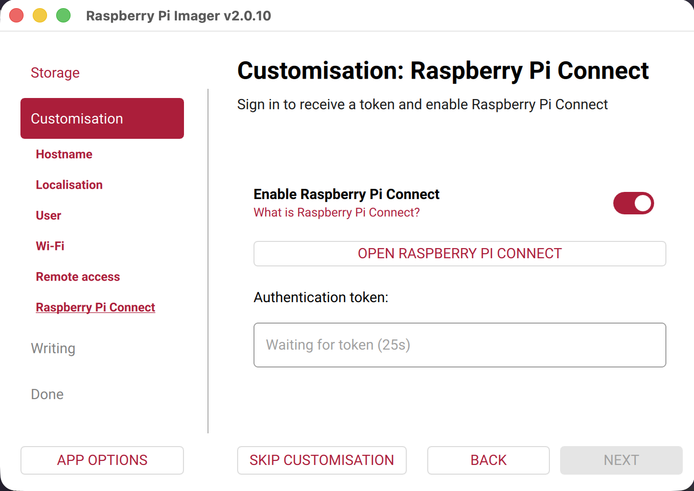
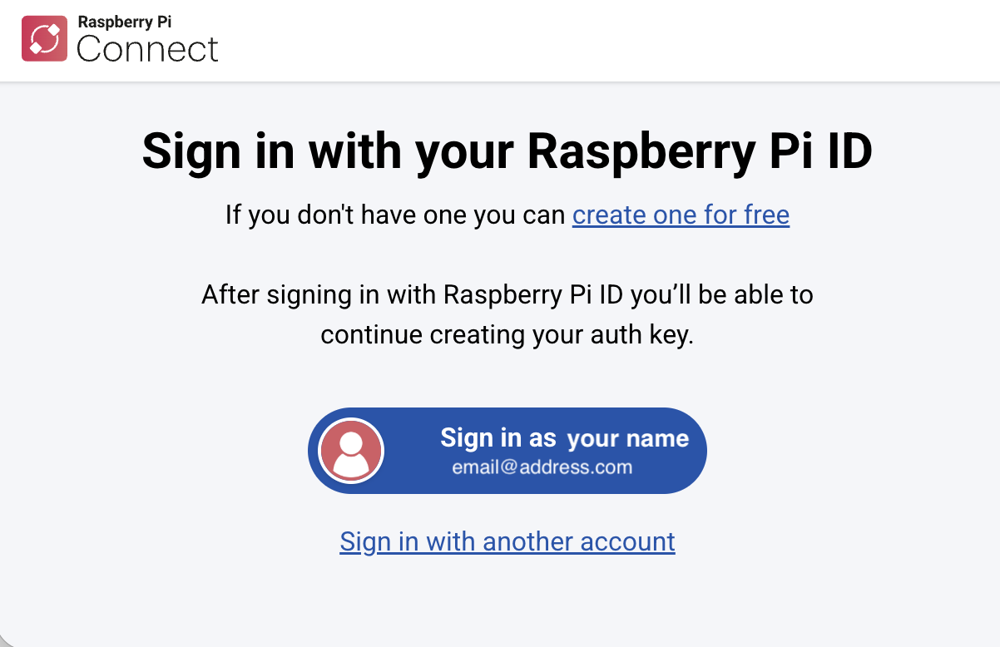
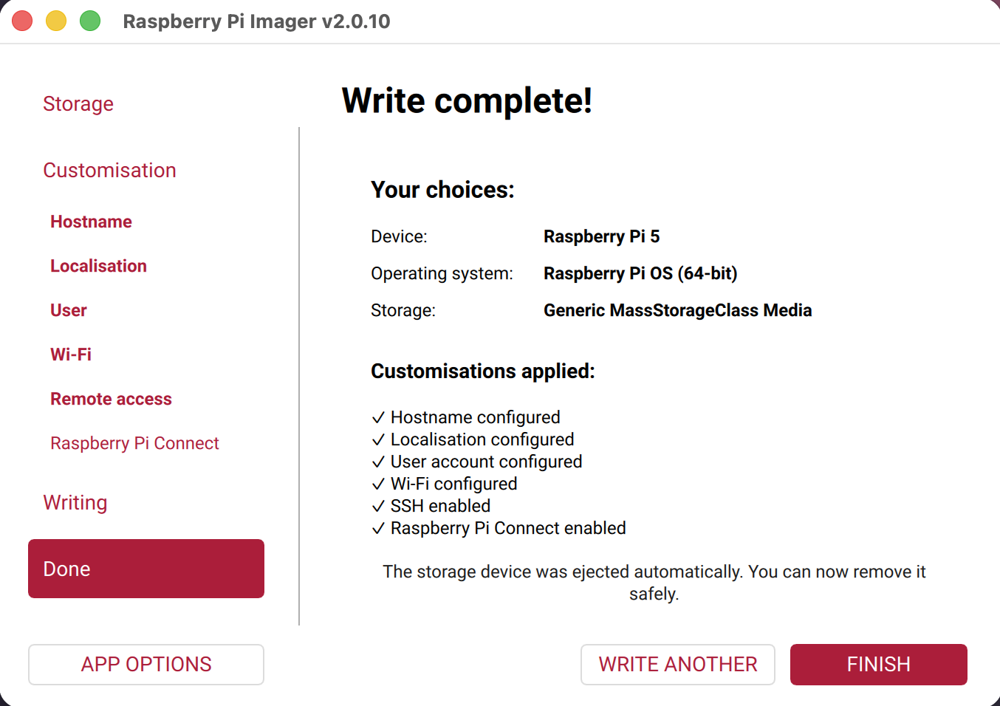

## Install Raspberry Pi OS

**Raspberry Pi OS** is the software that turns the board into a computer. It is saved onto a microSD card.

> [!TASK]
>
> Find the microSD card that came with your Raspberry Pi. Or, any card of 16GB or more will work.

> [!TASK]
>
> Plug it into your computer. Some laptops have a slot. Others need a USB card reader.

{:width="450px"}

> [!TASK]
>
> Install **Raspberry Pi Imager** from [raspberrypi.com/software](https://www.raspberrypi.com/software/){:target="_blank" rel="noopener"}.

> [!TASK]
>
> Open the Imager programme and choose the **Raspberry Pi model** you have, then click **Next**.

{:width="450px"}

> [!TASK]
>
> Choose the version of **Raspberry Pi OS** marked **Recommended**, then click **Next**.

{:width="450px"}

> [!TIP]
>
> The version depends on your Raspberry Pi model, so it may differ from the example.

> [!TASK]
>
> Choose the microSD card you are writing Raspberry Pi OS to. Keep
> **Exclude system drives** ticked, and check the card's size before you continue.

{:width="450px"}

> [!INFO]
>
> Be sure you have the correct microSD card, as writing erases everything on the card. There is no undo.

> [!TASK]
>
> Click **Next**, then edit the settings. Set your:
>
> - **hostname** and **username** these name your cyberdeck, you will use them for signing in. Pick some that are easy to type and make them recognisable, such as the hostname `cyberdeck` and the username `alex`.
> - **password** — this will be used to sign in. 
> - **wi-fi details** so that you can connect to the internet on your Raspberry Pi.

> [!TIP]
>
> Make sure you remember the hostname, username and password! **You will need these later, and nobody can recover them for you if you forget.**

> [!TASK]
>
> Under **Remote access**, turn on **SSH** and choose **Use password authentication**.

{:width="400px"}

### Optional: set up Raspberry Pi Connect

**Raspberry Pi Connect** lets you securely open your Raspberry Pi's desktop or command line in a web browser, even when you are away from it.

> [!TASK]
>
> In Imager, turn on **Enable Raspberry Pi Connect**. 

{:width="550px"}

> [!TASK]
>
> Then click the **Open Raspberry Pi Connect** link.

{:width="550px"}

> [!TASK]
>
> Your browser will open. Sign in with your **Raspberry Pi ID**, or create an account if you do not have one, then follow the instructions to return to Imager.

{:width="550px"}

### Review and write

> [!TASK]
>
> Review the device, operating system, storage and customisations. If they are correct, click **Write**.

{:width="450px"}

> [!TASK]
>
> You will receive a warning message. Check the storage device one last time. If it is the correct microSD card, click **I understand, erase and write**.

{:width="450px"}

> [!TASK]
>
> A final message will pop up when the Imager has finished. Click **Finish**, and you can now remove the microSD card.

{:width="450px"}

> [!DEBUG]
>
> Imager cannot see the card? Take it out, put it back, and click **Choose storage** again.
>
> Write failed partway? Try a different card reader. Readers fail more often than cards.
