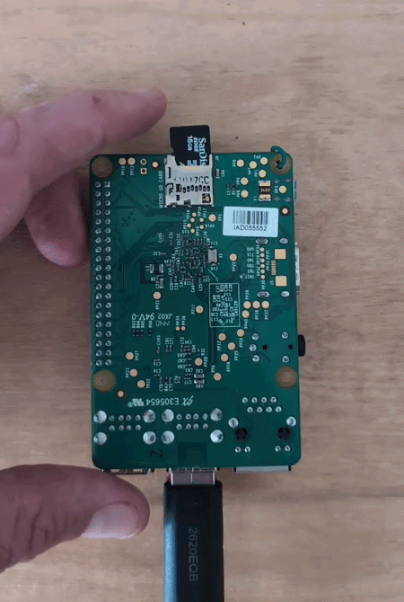
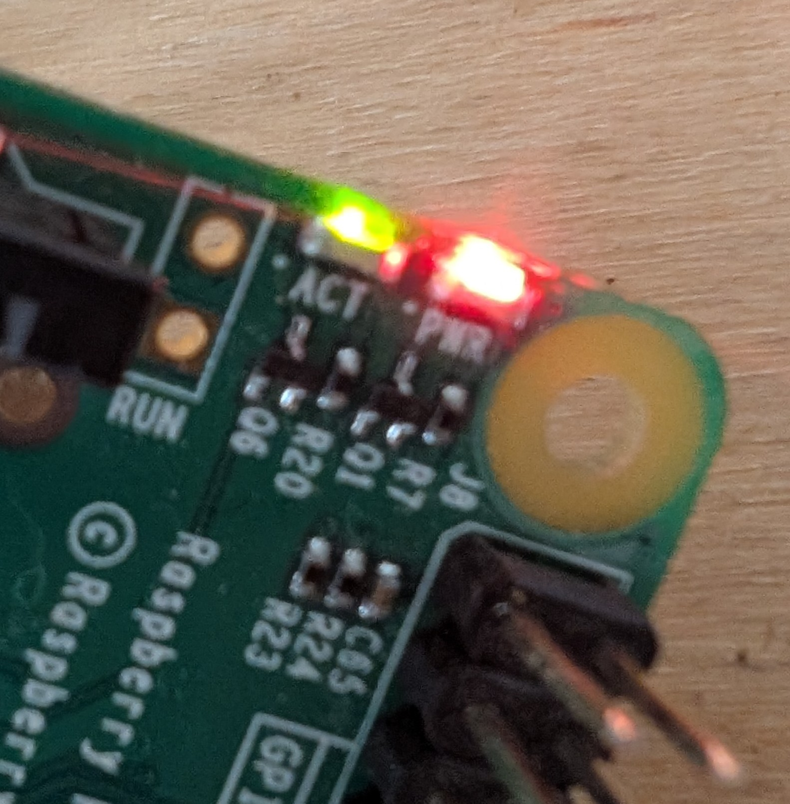

## Set up your Raspberry Pi

Time to switch it on for the first time.

{:width="300px"}

> [!INFO]
>
> The card slot does not feel the same on every Raspberry Pi.
>
> **Friction-fit slots** on Raspberry Pi 3, 4, 5 and every Zero model hold the microSD
> card without a click. Slide it in until it stops; pull it gently to remove it.
>
> **Click-in slots** on Raspberry Pi 1 Model A+/B+, Raspberry Pi 2, and the Raspberry Pi
> 400 and 500 keyboard computers use a small spring. Push the card until it clicks; push
> it once more to release it.
>
> The original Raspberry Pi 1 Model A and B use a full-size, friction-fit SD card. Never
> force either type of card.

> [!TASK]
>
> Find the card slot. It is underneath most Raspberry Pi boards and on the back of the
> keyboard computers. Insert the card gently; it goes in only one way round.
>
> Connect the display, keyboard and your chosen pointing device. You can skip the last
> one if you are using a touchscreen.
>
> Connect the power last. Most models start immediately; if yours has a power button,
> press it.

**Test:** At least one status light comes on. If a display is connected, the Raspberry
Pi logo appears.

{:width="300px"}

> [!DEBUG]
>
> Nothing at all? Check the power supply is on at the wall, and is the right one for your model.
>
> Light on, screen black? Check the HDMI cable. On a Raspberry Pi 4 or 5, use the socket nearest the power connector.
>
> Restarting by itself, or a lightning bolt in the corner? The power supply is too weak.

The first start is slow. With Imager settings filled in, it goes straight to the desktop.

{:width="450px"}

> [!TASK]
>
> If a welcome screen appears instead, work through it.
>
> Use the same username and password you set in Imager.

**Test:** The desktop appears, with the raspberry menu top left.

> [!TASK]
>
> Let the updates run. Restart when it asks.

> [!TASK]
>
> Check the network icon, top right. It should show wi-fi, not two red crosses.

> [!TIP]
>
> Hover over the network icon. It shows the name of your Raspberry Pi and its **IP address**. Note both down for the next two steps.
