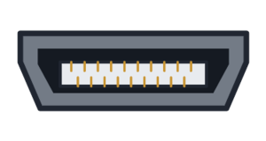
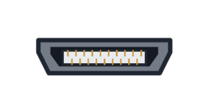
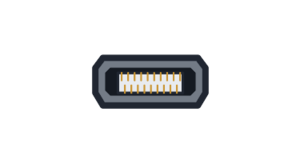

## Plug in the devices

> [!TASK]
>
> Plug in all devices **EXCEPT the power**, (the display, keyboard and pointing device).

{:width="300px"}

### Connecting keyboard and pointer

Using **wired USB** for your pointer and keyboard is dependable and needs no batteries, but a separate keyboard and mouse usually use two sockets.

Some keyboards have a **built-in USB hub**. With this you can plug the mouse into the keyboard to keep one Raspberry Pi socket free.

A **wireless USB receiver** uses one socket for both a keyboard and mouse, and saves space.

**Bluetooth** can keep the USB sockets completely free, but the devices need pairing and power. Also, Raspberry Pi models without built-in Bluetooth would need a USB Bluetooth adaptor.

### Connecting a display

When setting up your Raspberry Pi, you can use any **monitor** with an HDMI input, even a **television** or **projector**. This will be to big for the cyberdeck case, but it makes setting up easier.

> [!INFO]
>
> Most monitors, televisions and projectors use full-size HDMI, so choose a cable or adaptor that matches both ends.
>
> - Raspberry Pi 4, 5, 400, 500 and 500+ use **micro** HDMI. 
> - Raspberry Pi Zero uses **mini** HDMI.

> [!INFO]
>
> HDMI sockets come in three sizes.
>
> | Full-size HDMI | Mini HDMI | Micro HDMI |
> |:---:|:---:|:---:|
> | {:width="100px"} | {:width="100px"} | {:width="100px"} |

> [!INFO]
>
> A Raspberry Pi Zero needs a **Micro-USB OTG adaptor** or hub for an ordinary USB keyboard, mouse or wireless receiver. Connect it to the USB data socket, not the one labelled **PWR IN**.