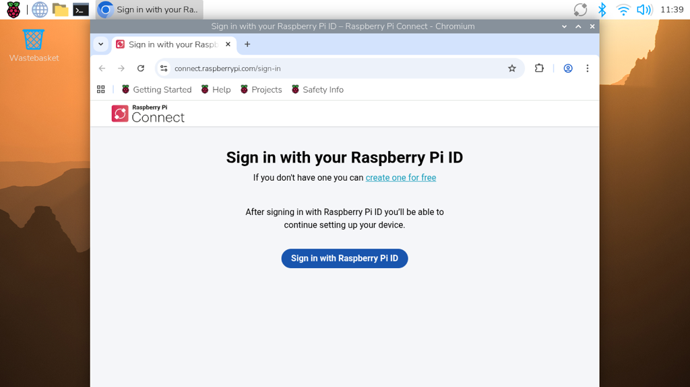
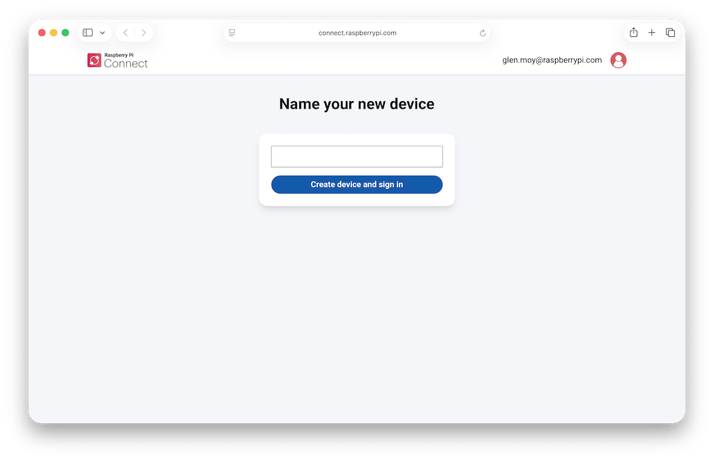

## Use Raspberry Pi Connect

**Raspberry Pi Connect** puts your Raspberry Pi's desktop in a browser on another computer. That is handy for a cyberdeck: you can leave the monitor behind and still reach the whole desktop when you need it.

{:width="450px"}

> [!TASK]
>
> On your Raspberry Pi, open a **terminal** with the black icon in the top bar.
>
> ```bash
> sudo apt update && sudo apt install rpi-connect
> ```

> [!INFO]
>
> Raspberry Pi Connect is already installed in current Raspberry Pi OS Desktop and Full images. If the command says it is already the newest version, you are ready to continue.

> [!TASK]
>
> Turn it on, then start signing in.
>
> ```bash
> rpi-connect on
> rpi-connect signin
> ```

> [!TASK]
>
> Open the web address printed in the terminal. You can use the browser on the Raspberry Pi or type the address into another computer.
>
> Sign in with your **Raspberry Pi ID**, or create one for free if you do not have an account yet.

{:width="450px"}

> [!TASK]
>
> Give your Raspberry Pi a name you will recognise, then click **Create device and sign in**.

{:width="450px"}

**Test:** The Connect icon in the top bar turns blue.

> [!TASK]
>
> Go to another computer. Open [connect.raspberrypi.com](https://connect.raspberrypi.com) and sign in with the same Raspberry Pi ID.

{:width="450px"}

> [!TASK]
>
> Find your Raspberry Pi. The example calls its device **pitowers**, but yours will show the name you chose. Select **Connect via**, then **Screen sharing**.

**Test:** The Raspberry Pi desktop appears in the browser. Moving the mouse there moves the pointer on the Raspberry Pi itself.

> [!DEBUG]
>
> Shows as offline? Check the Raspberry Pi is on and still on wi-fi. Both computers need to be online.
>
> Screen sharing unavailable? Run `rpi-connect doctor` in a terminal on the Raspberry Pi. It checks the service, desktop and network, and puts a cross beside anything that needs attention.

> [!TIP]
>
> Connect works from anywhere, not only at home.

*Official sign-in, device-name and dashboard screenshots: © Raspberry Pi Ltd, from the [Raspberry Pi Connect documentation](https://www.raspberrypi.com/documentation/services/connect.html), licensed under [CC BY-SA 4.0](https://creativecommons.org/licenses/by-sa/4.0/). Displayed at a smaller size.*
