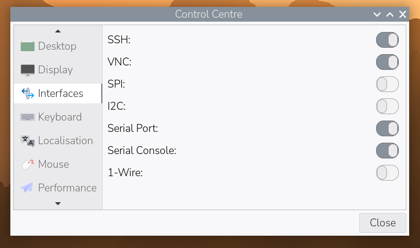
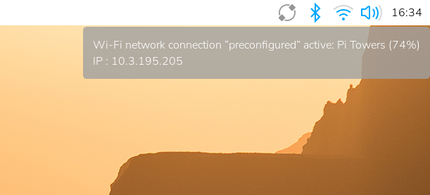

## Connect with SSH

**SSH**, short for Secure Shell, gives you an encrypted terminal connection to your
Raspberry Pi from another computer on the same local network. It is text only — no
desktop — and usually quicker than screen sharing.

> [!INFO]
>
> For this project, keep SSH inside your private network. Both computers should be
> connected to the same router or local network.

> [!TASK]
>
> Make sure SSH is switched on. If you enabled it in Raspberry Pi Imager, it should
> already be ready.
>
> To check from the Raspberry Pi desktop, open the Raspberry Pi menu, then
> **Preferences** and **Control Centre**. Select **Interfaces**, switch **SSH** on and
> select **Close**. If you changed the switch, restart the Raspberry Pi before you
> continue.

{:width="450px"}

> [!TIP]
>
> You can also open a terminal on the Raspberry Pi and run:
>
> ```bash
> sudo raspi-config
> ```
>
> Choose **3 Interface Options**, then **I1 SSH**, **Yes**, **OK** and **Finish**. Use
> the arrow keys to move and **Enter** to choose.

> [!TASK]
>
> Find your Raspberry Pi's hostname and local IP address.
>
> ```bash
> hostname
> hostname -I
> ```
>
> The first command prints its name. The second prints one or more network addresses;
> the local address usually looks something like `192.168.1.42`. Write both down.

> [!TIP]
>
> On the desktop, you can also hover over the network icon in the top-right corner to
> see the local IP address. Your network name and numbers will differ from this example.

{:width="450px"}

> [!TASK]
>
> Open a terminal on the other computer.
>
> **Windows** — open Terminal or PowerShell from the Start menu. **Mac** — open Terminal
> from Applications, then Utilities. **Linux** — open your usual terminal program.

> [!TASK]
>
> Connect using the username and hostname you chose in Imager. For example, if the
> username is `alex` and the hostname is `cyberdeck`, run:
>
> ```bash
> ssh alex@cyberdeck.local
> ```
>
> The first time you connect, SSH asks whether you trust this computer. Check that you
> are connecting to your own Raspberry Pi, then type `yes` and press **Enter**. Enter
> your Raspberry Pi password when asked.

> [!INFO]
>
> Nothing appears while you type a password — not even dots. Keep typing, then press
> **Enter**.

**Test:** The prompt changes to show the Raspberry Pi's username and hostname, such as
`alex@cyberdeck:~ $`.

> [!TASK]
>
> Ask the remote computer for its hostname.
>
> ```bash
> hostname
> ```

**Test:** The reply matches the Raspberry Pi hostname you wrote down earlier.

> [!DEBUG]
>
> **Could not resolve hostname?** Connect with the IP address instead. Replace the
> example username and numbers with your own:
>
> ```bash
> ssh alex@192.168.1.42
> ```
>
> **Connection timed out?** Check that the Raspberry Pi is on and both computers are on
> the same local network. Check the IP address again too.
>
> **Connection refused?** SSH may be off, or the address may lead to a different device.
> Return to the first task and check both.
>
> **Permission denied?** Check the username and password you entered in Imager, and make
> sure **Caps Lock** is off.

> [!TASK]
>
> When you have finished, close the SSH connection:
>
> ```bash
> exit
> ```

> [!TIP]
>
> SSH suits commands and files. Connect suits anything with windows and buttons.

*Official Control Centre and network screenshots: © Raspberry Pi Ltd, from the [Raspberry Pi remote-access documentation](https://www.raspberrypi.com/documentation/computers/remote-access.html), licensed under [CC BY-SA 4.0](https://creativecommons.org/licenses/by-sa/4.0/). Displayed at a smaller size.*
